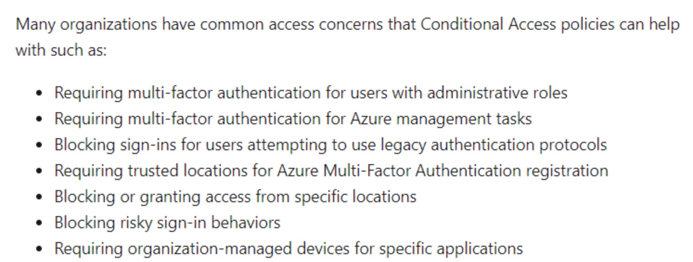

201 Concepts

**Privileged Identity Management**
Privileged Identity Management provides time-based and approval-based role activation to mitigate the risks of excessive, unnecessary, or misused access permissions on resources that you care about. Here are some of the key features of Privileged Identity Management:

- Provide **just-in-time privileged access** to Azure AD and Azure resources
- Assign **time-bound access** to resources using start and end dates
- Require **approval to activate** privileged roles
- Enforce **multi-factor authentication** to activate **any** role
- Use (through requests) **justification** to understand why users activate
- Get notifications when privileged roles are activated
- Conduct access reviews to ensure users still need roles
- Download audit history for internal or external audit

***
**Azure Idenetity Protection**
Identity Protection is a tool that allows organizations to accomplish three key tasks:

- **Automate the detection and remediation** of identity-based risks.
- **Investigate risks** using data in the portal.
- Export risk detection data to third-party utilities for further analysis.

***
**Conditional Access Policies**
Conditional Access is the tool used by Azure Active Directory to bring signals together, to make decisions, and enforce organizational policies. Conditional Access is at the heart of the new identity driven control plane.

Conditional Access policies at their simplest are if-then statements, if a user wants to access a resource, then they must complete an action. Example: A payroll manager wants to access the payroll application and is required to perform multi-factor authentication to access it.

Administrators are faced with two primary goals:
- Empower users to be productive wherever and whenever
- Protect the organization's assets

By using Conditional Access policies, you can apply the right access controls when needed to keep your organization secure and stay out of your user’s way when not needed.
