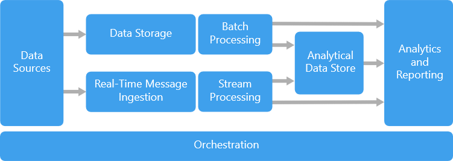

201 Lambda

The typical workflow is mostly the same. DP201 will likely not involve Kappa architectures, only Lambda. In this section, I've written down typical technology choices and the keywords that often accompany them in a question description.

Streaming layer: 
1. Ingest: Event hub (high volume + high speed) or IoT hub (specific when IoT is named) or Event bus (low volume, more traditional business conent) or CosmosD (if persistence/ hot/ ttl is named)
2. Process: Azure Stream Analytics (if T-SQL is named/ add keywords) or Azure Databricks (structured streaming, unified analytics, interactive, data discovery)

Batch layer:
1. Ingest (storage): Azure Data Lake (optimized for big data analytics) or Azure Storage
2. Process: Azure Databricks (If Python or Scala is named) or Data Factory (not often used here though) or Azure DWH Polybase
3. 

Analytical Data Store:
1. Often Azure DWH (columnar, analytical data store, etc) or Azure SQL, possibly even Cosmos (only if document, NoSQL, public facing is named)

Orchestration:
1. In the context of DP201, this is likely Azure Data Factory
