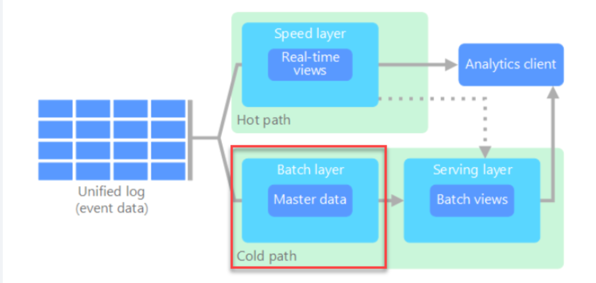
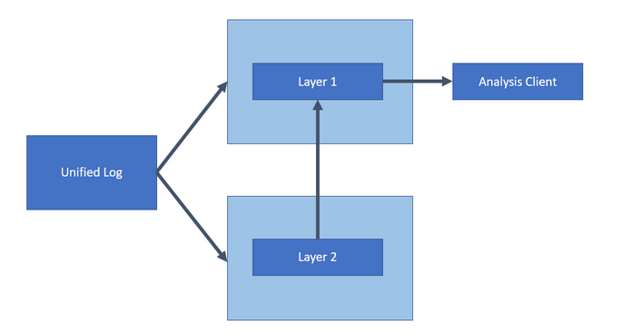

201 keywords

## Lambda Architecture

**Cold Path** (Think in tiers with respect to layers)
- **Batch Layer**: Often Azure Storage/ Data Lake
- **Model & Serving Layer**: Often Azure DWH

**Hot Path**
- **Speed Layer**: Often Azure Event Hubs or Stream Analytics Jobs

***
## Kappa Architecture
According to Microsoft reference architectures, Layer 1 serves as a **speed layer** where data can be **accessed easily**. A good fit for this layer would be Cosmos DB. **Layer 2** serves as a **long-term data store**. A good fit for this layer would be Azure DWH.

***
A company wants design a solution that supports ingestion and analysis of logs in **real time**. 
- Event Hubs
- Databricks/ OR SAM
- 

***
Behave as an OLTP store -> Azure SQL (In-Memory processing table)
Run queries across petabytes of data -> Azure DWH
Store data in columnar format -> Azure DWH