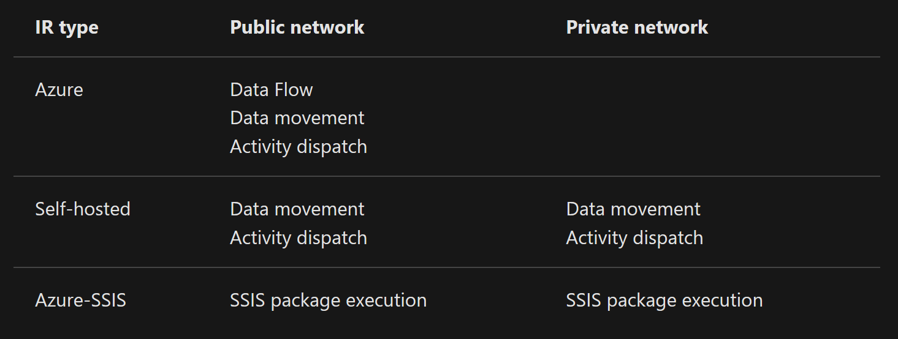
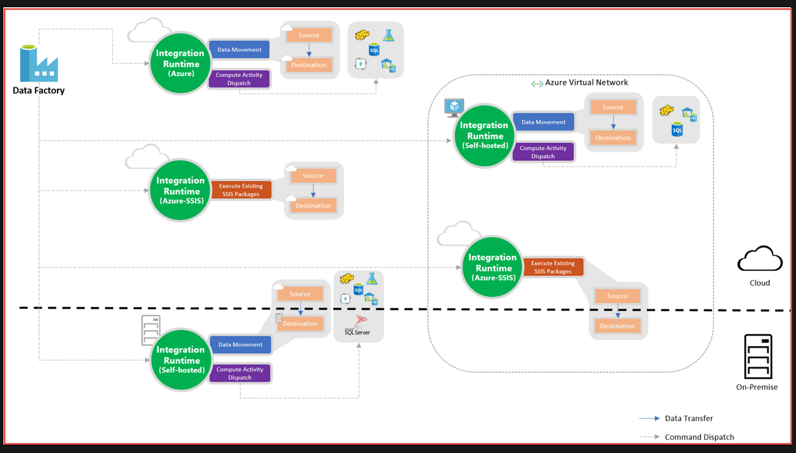

ADF Integration Runtime

## Determining which IR to use

- **Copying between two cloud data sources:** when both source and sink linked services are using Azure IR, ADF will use the regional Azure IR if you specified, or auto determine a location of Azure IR if you choose the auto-resolve IR (default)
- **Copying between a cloud data source and a data source in private network:** if either source or sink linked service points to a self-hosted IR, the copy activity is executed on that self-hosted Integration Runtime.
- **Copying between two data sources in private network:**

https://docs.microsoft.com/nl-nl/azure/data-factory/concepts-integration-runtime
***
**In a VNET, you can use SSIS-IR to connect with on premise data stores to run SSIS packages. When there are network restrictions and it is not possible to run a custom VNET, you should use a self-hosted IR (because it uses the HTTPS port) and run an ETL job in stages (first with the self-hosted IR to blob storage, then with the SSIS-IR).**
