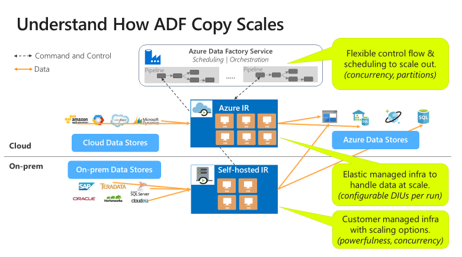
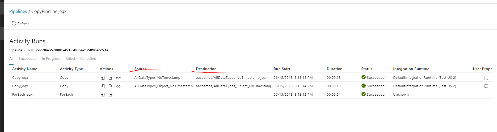

ADF Monitoring

## Monitoring and Performance Tuning
Select the Details button in the Actions column to see the Copy activity's execution details and performance characteristics. You see information like volume/number of rows/number of files of data copied from source to sink, throughput, steps the Copy activity goes through with corresponding durations, and configurations used for your copy scenario.

- ADF control flow can start multiple copy activities in parallel, for example using For Each loop.
- A single copy activity can take advantage of scalable compute resources: when using Azure Integration Runtime, you can specify up to 256 DIUs for each copy activity in a serverless manner; when using self-hosted Integration Runtime, you can manually scale up the machine or scale out to multiple machines (up to 4 nodes), and a single copy activity will partition its file set across all nodes.
- A single copy activity reads from and writes to the data store using multiple threads in parallel.

### Log Analytics
Data Factory stores pipeline-run data for only 45 days. Use Monitor if you want to keep that data for a longer time. With Monitor, you can route diagnostic logs for analysis. You can also keep them in a storage account so that you have factory information for your chosen duration. It also allows you to monitor multiple data pipelines/ factories from a single point of view.
***

**User properties**
User properties are just pipeline annotations for monitor purposes. In contrast to annotations, you can specify user properties as literal string or (dynamic) expressions and they will be shown out as columns at monitor tab. For example, you could use them to mark what is destination table and source table for a specific pipeline. 

https://social.msdn.microsoft.com/Forums/en-US/8692cd00-307b-4204-a547-bed2030cb762/adfv2-user-property-setting?forum=AzureDataFactory
