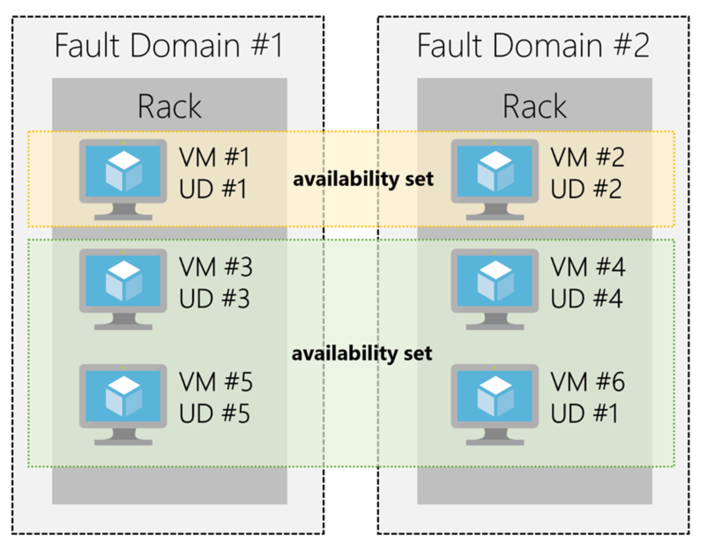

Azure Compute

Azure compute is an on-demand computing service for running cloud-based applications. It provides computing resources like multi-core processors and supercomputers via virtual machines and containers. It also provides serverless computing to run apps without requiring infrastructure setup or configuration. The resources are available on-demand and can typically be created in minutes or even seconds. You pay only for the resources you use and only for as long as you're using them.

There are four common techniques for performing compute in Azure:
- Virtual machines
- Containers
- Azure App Service
- Serverless computing

***
#### Virtual Machines
 Just like a physical computer, you can customize all of the software running on the VM. VMs are an ideal choice when you need:
- Total control over the operating system (OS)
- The ability to run custom software, or
- To use custom hosting configurations

Selecting an image is one of the most important decisions you'll make when creating a VM. An image is a template used to create a VM. These templates already include an OS and often other software, like development tools or web hosting environments.

##### Scaling #####
You can run single VMs for testing, development, or minor tasks, or group VMs together to provide high availability, scalability, and redundancy.  Azure has several features so that no matter what your uptime requirements:
- Availability sets
- Scale sets
- Azure Batch

An **availability set** is a logical grouping of two or more VMs that help keep your application available during *planned* or *unplanned* maintenance. VM's in an availability set automaticlly switch to a working VM or sequence maintenance to maximise availability.

**Scale Sets** let you create and manage a group of identical, load balanced VMs. Imagine you're running a website that enables scientists to upload astronomy images that need to be processed. If you duplicated the VM, you'd normally need to configure an additional service to route requests between multiple instances of the website. VM Scale Sets could do that work for you.

**Azure Batch** enables large-scale job scheduling and compute management with the ability to scale to tens, hundreds, or thousands of VMs.

***
#### Containers
If you wish to run multiple instances of an application on a single virtual machine, containers are an excellent choice. The container orchestrator can start, stop, and scale out application instances as needed.

#### Managing containers
Azure supports Docker containers, and there are several ways to manage containers in Azure.
- Azure Container Instances (ACI) (Simple container executioner)
- Azure Kubernetes Service (AKS) (Orchestration)

***
#### Azure App Service
Azure App Service enables you to build and host web apps, background jobs, mobile backends, and RESTful APIs in the programming language of your choice without managing infrastructure. It offers auto-scaling and high availability, supports both Windows and Linux, and enables automated deployments from GitHub, Azure DevOps, or any Git repo to support a continuous deployment model.

**App Service** includes full support for hosting web apps using ASP.NET, ASP.NET Core, Java, Ruby, Node.js, PHP, or Python. It closely resembles a web server in the cloud.

With **API Apps** you can build REST-based Web APIs using your choice of language and framework. You get full Swagger support, and the ability to package and publish your API in the Azure Marketplace. The produced apps can be consumed from any HTTP(s) based client.

**WebJobs** allows you to run a program (.exe, Java, PHP, Python or Node.js) or script (.cmd, .bat, PowerShell, or Bash) in the same context as a web app, API app, or mobile app. They can be scheduled, or run by a trigger. This is often used to run background tasks as part of your application logic.

Use the **Mobile Apps** feature of Azure App Service to quickly build a back-end for iOS and Android apps. 

***
#### Serverless
With serverless computing, Azure takes care of managing the server infrastructure and allocation/deallocation of resources based on demand. Infrastructure isn't your responsibility. Scaling and performance are handled automatically, and you are billed only for the exact resources you use. There's no need to even reserve capacity.

Azure has two implementations of serverless compute:
- Azure Functions which can execute code in almost any modern language.
- Azure Logic Apps which are designed in a web-based designer and can execute logic triggered by Azure services without writing any code.

