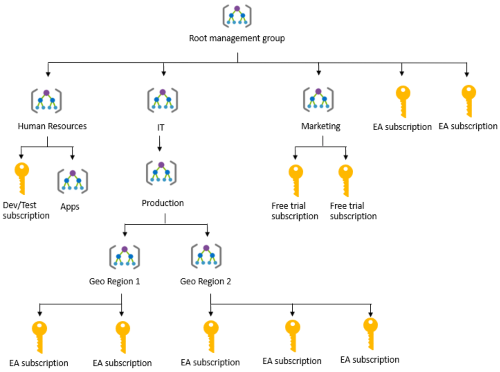

Azure Governance

#### Policies
Planning out a consistent cloud infrastructure starts with setting up policy. Your policies will enforce your rules for created resources, so your infrastructure stays compliant with your corporate standards, cost requirements, and service-level agreements (SLAs) you have with your customers.

**Azure Policy** is a service in Azure that you use to define, assign, and, manage standards for resources in your environment. It can prevent the creation of disallowed resources, ensure new resources have specific settings applied, and run evaluations of your existing resources to scan for non-compliance.

Azure Policy comes with many built-in policy and initiative definitions that you can use, under categories such as Storage, Networking, Compute, Security Center, and More.

The process of creating and implementing an Azure Policy begins with creating a **policy definition**. Every policy definition has conditions under which it is enforced. And, it has an accompanying effect that takes place if the conditions are met. To apply a policy, you will:

- Create a policy definition
- Assign a definition to a scope of resources
- View policy evaluation results

The policy definition itself is represented as a JSON file - you can use one of the pre-defined definitions in the portal or create your own (either modifying an existing one or starting from scratch). There are hundreds of samples available on GitHub. 
Each policy definition in Azure Policy has a single effect. That effect determines what happens when the associated policy rule is matched. When that happens, Azure Policy will take a specific action based on the assigned effect.
Policy Effect 	What happens?

- **Deny** -	The resource creation/update fails due to policy.
- **Disabled** - 	The policy rule is ignored (disabled). Often used for testing.
- **Append** - 	Adds additional parameters/fields to the requested resource during creation or update. A common example is adding tags on resources such as Cost Center or specifying allowed IPs for a storage resource.
- **Audit, AuditIfNotExists** - 	Creates a warning event in the activity log when evaluating a non-compliant resource, but it doesn't stop the request.
- **DeployIfNotExists** - 	Executes a template deployment when a specific condition is met. For example, if SQL encryption is enabled on a database, then it can run a template after the DB is created to set it up a specific way.

Once a **policy defintion is made**, it can be **assigned** to one or more subscriptions, resource groups or resources.
***
#### Initiatives
Initiatives work alongside policies in Azure Policy. An initiative definition is a set or group of policy definitions to help track your compliance state for a larger goal. Even if you have a single policy, we recommend using initiatives if you anticipate increasing the number of policies over time.

Like a policy assignment, an initiative assignment is an initiative definition assigned to a specific scope. Initiative assignments reduce the need to make several initiative definitions for each scope. This scope could also range from a management group to a resource group.

Initiative definitions simplify the process of managing and assigning policy definitions by grouping a set of policies into a single item. For example, you could create an initiative named Enable Monitoring in Azure Security Center, with a goal to monitor all the available security recommendations in your Azure Security Center. This initiative could include policy definitions such as Monitor OS vulnerabilities, Monitor unencrypter SQL databases, etc. 

***
#### Azure Management Groups
Azure Management Groups are containers for managing access, policies, and compliance across multiple Azure subscriptions. Management groups allow you to order your Azure resources hierarchically into collections, which provide a further level of classification that is above the level of subscriptions. All subscriptions within a management group automatically inherit the conditions applied to the management group. Management groups give you enterprise-grade management at a large scale no matter what type of subscriptions you might have.

The following diagram shows an example of creating a hierarchy for governance using management groups.

Another scenario where you would use management groups is to provide user access to multi subscriptions. By moving many subscriptions under that management group, you can create one role-based access control (RBAC) assignment on the management group, which will inherit that access to all the subscriptions. 

***
#### Azure Blueprint

Azure Blueprint allows you to define a repeatable set of Azure resources that implement and adhere to your organization's standards, patterns, and requirements. Blueprint enables development teams to rapidly build and deploy new environments with the knowledge that they're building within organizational compliance with a set of built-incomponents that speed up development and delivery.

Azure Blueprint is a declarative way to orchestrate the deployment of various resource templates and other artifacts, such as:
- Role assignments
- Policy assignments
- Azure Resource Manager templates
- Resource groups

***
#### Monitoring

**Azure Monitor** maximizes the availability and performance of your applications by delivering a comprehensive solution for collecting, analyzing, and acting on telemetry from your cloud and on-premises environments. It helps you understand how your applications are performing and proactively identifies issues affecting them and the resources they depend on. Azure Monitor can collect data from a variety of sources. You can think of monitoring data for your applications in tiers ranging from your application, any operating system and services it relies on, down to the platform itself.

**Azure Service Health** is a suite of experiences that provide personalized guidance and support when issues with Azure services affect you. It can notify you, help you understand the impact of issues, and keep you updated as the issue is resolved. Azure Service Health can also help you prepare for planned maintenance and changes that could affect the availability of your resources.

