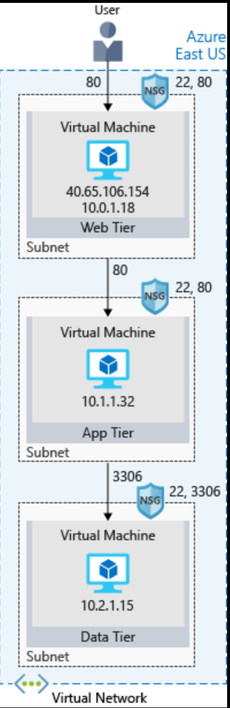
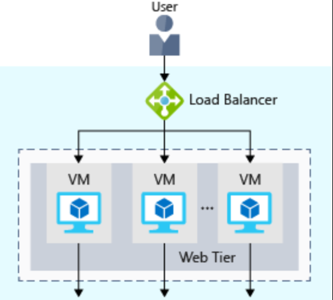
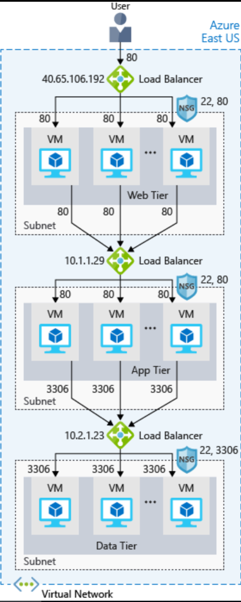
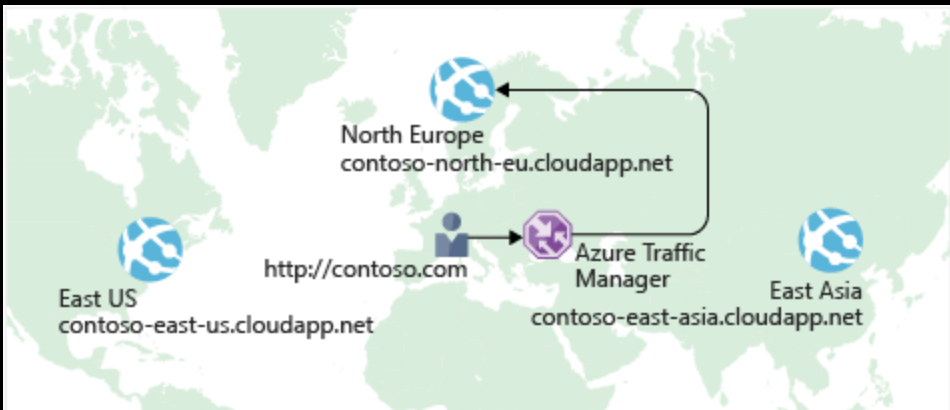

Azure Networks

 #### Azure VNET
A virtual network is a logically isolated network on Azure. Azure virtual networks will be familiar to you if you've set up networks on Hyper-V, VMware, or even on other public clouds. A virtual network allows Azure resources to securely communicate with each other, the internet, and on-premises networks. A virtual network is scoped to a single region; however, multiple virtual networks from different regions can be connected together using virtual network peering.

***
#### Network segmenting with subnets
 
 Azure has many features to build loosely coupled architectures (such as n-tier, microservices, etc) and networking plays a large role in this. The following illustration shows a three-tier architecture running on virtual machines with security features enabled to restrict inbound requests.

Virtual networks can be segmented into one or more subnets. Subnets help you organize and secure your resources in discrete sections. The web, application, and data tiers each have a single VM. All three VMs are in the same virtual network but are in separate subnets.

Users interact with the web tier directly, so that VM has a public IP address along with a private IP address. Users don't interact with the application or data tiers, so these VMs each have a private IP address only.

You can also keep your service or data tiers in your on-premises network, placing your web tier into the cloud, but keeping tight control over other aspects of your application. A VPN gateway (or virtual network gateway), enables this scenario. It can provide a secure connection between an Azure Virtual Network and an on-premises location over the internet.

Azure manages the physical hardware for you. You configure virtual networks and gateways through software, which enables you to treat a virtual network just like your own network. You choose which networks your virtual network can reach, whether that's the public internet or other networks in the private IP address space.

#### NSG (Network Security Group)

A network security group, or NSG, allows or denies inbound network traffic to your Azure resources. Think of a network security group as a cloud-level firewall for your network.

For example, notice that the VM in the web tier allows inbound traffic on ports 22 (SSH) and 80 (HTTP). This VM's network security group allows inbound traffic over these ports from all sources. You can configure a network security group to accept traffic only from known sources, such as IP addresses that you trust.

## Availability

***
#### Load Balancers

A load balancer distributes traffic evenly among each system in a pool. A load balancer can help you achieve both high availability and resiliency.

Say you start by adding additional VMs, each configured identically, to each tier. The idea is to have additional systems ready, in case one goes down, or is serving too many users at the same time.

The problem here is that each VM would have its own IP address. Plus, you don't have a way to distribute traffic in case one system goes down or is busy. How do you connect your VMs so that they appear to the user as one system?

The answer is to use a load balancer to distribute traffic. The load balancer becomes the entry point to the user. The user doesn't know (or need to know) which system the load balancer chooses to receive the request.

The following illustration shows the role of a load balancer.

The load balancer receives the user's request and directs the request to one of the VMs in the web tier. If a VM is unavailable or stops responding, the load balancer stops sending traffic to it. The load balancer then directs traffic to one of the responsive servers.

Load balancing enables you to run maintenance tasks without interrupting service. 

***
#### Azure Load Balancer
Azure Load Balancer is a load balancer service that Microsoft provides that helps take care of the maintenance for you. Load Balancer supports inbound and outbound scenarios, provides low latency and high throughput, and scales up to millions of flows for all Transmission Control Protocol (TCP) and User Datagram Protocol (UDP) applications. You can use Load Balancer with incoming internet traffic, internal traffic across Azure services, port forwarding for specific traffic, or outbound connectivity for VMs in your virtual network.

***
#### Azure Application Gateway
If **all** your traffic is HTTP, a potentially better option is to use Azure Application Gateway. Application Gateway is a load balancer designed for web applications. It uses Azure Load Balancer at the transport level (TCP) and applies sophisticated URL-based routing rules to support several advanced scenarios.

***
## Latency

#### Azure Traffic Manager
Previously, you saw how Azure Load Balancer helps you achieve high availability and minimize downtime.

Although your e-commerce site is more highly available, it doesn't solve the issue of latency or create resiliency across geographic regions. A user from NA reaching out to a VM in China may experience geographical latency. 

Azure Load Balancer distributes traffic within the same region to make your services more highly available and resilient. Traffic Manager works at the DNS level, and directs the client to a preferred endpoint. This endpoint can be to the region that's closest to your user.Traffic Manager doesn't see the traffic that's passed between the client and server. Rather, it directs the client web browser to a preferred endpoint. Traffic Manager can route traffic in a few different ways, such as to the endpoint with the lowest latency.

***
A **virtual network gateway** is the software VPN device for your Azure virtual network. Use this with a connection to set up a site-to-site VPN connection between an Azure virtual network and your local network, or a VNet-to-VNet VPN connection between two Azure virtual networks. 

