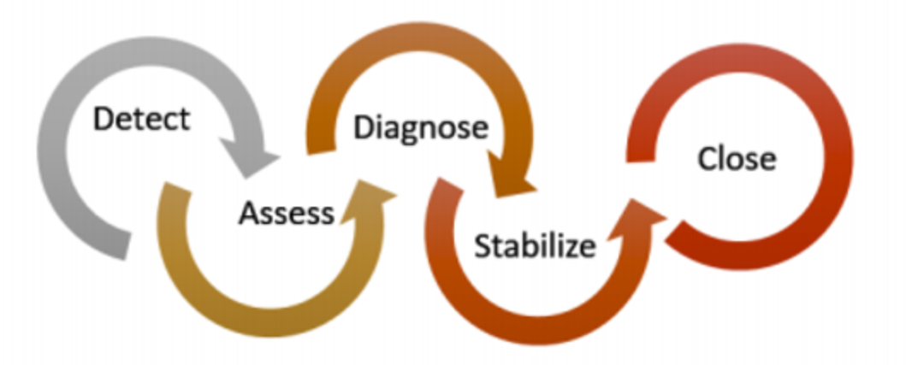
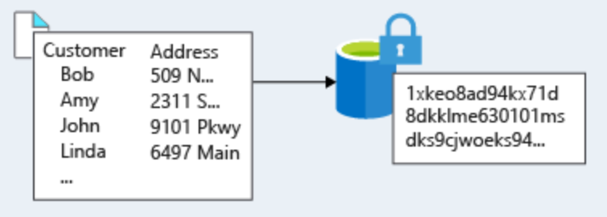
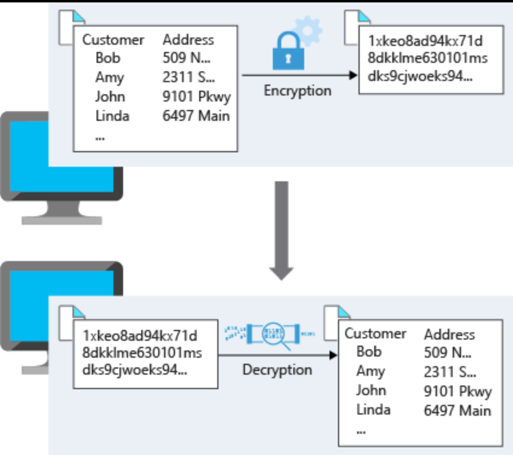

Azure Security

#### Azure Security Center
A great place to start when examining the security of your Azure-based solutions is Azure Security Center. Security Center is a monitoring service that provides threat protection across all of your services both in Azure, and on-premises. 

You can integrate Security Center into your workflows and use it in many ways. Here are two examples:

- **Use Security Center for incident response.** Many organizations learn how to respond to security incidents only after suffering an attack. To reduce costs and damage, it’s important to have an incident response plan in place before an attack occurs. You can use Azure Security Center in different stages of an incident response.
    - Detect. Review the first indication of an event investigation. For example, you can use the Security Center dashboard to review the initial verification that a high-priority security alert was raised.
    - Assess. Perform the initial assessment to obtain more information about the suspicious activity. For example, obtain more information about the security alert.
    - Diagnose. Conduct a technical investigation and identify containment, mitigation, and workaround strategies. For example, follow the remediation steps described by Security Center in that particular security alert.
- **Use Security Center recommendations to enhance security.** You can reduce the chances of a significant security event by configuring a security policy, and then implementing the recommendations provided by Azure Security Center.

***
#### Identity and Access Management
Network perimeters, firewalls, and physical access controls used to be the primary protection for corporate data. But network perimeters have become increasingly porous with the explosion of bring your own device (BYOD), mobile apps, and cloud applications.

*Identity has become the new primary security boundary.* Therefore, proper authentication and assignment of privileges is critical to maintaining control of your data. Two fundamental concepts that need to be understood when talking about identity and access control are authentication and authorization. They underpin everything else that happens and occur sequentially in any identity and access process:

- **Authentication** is the process of establishing the identity of a person or service looking to access a resource. It involves the act of challenging a party for legitimate credentials, and provides the basis for creating a security principal for identity and access control use. It establishes if they are who they say they are.
- **Authorization** is the process of establishing what level of access an authenticated person or service has. It specifies what data they're allowed to access and what they can do with it.

***
#### Azure Active Directory
Azure AD is a cloud-based identity service. It has built in support for synchronizing with your existing on-premises Active Directory or can be used stand-alone. This means that all your applications, whether on-premises, in the cloud (including Office 365), or even mobile can share the same credentials. Administrators and developers can control access to internal and external data and applications using centralized rules and policies configured in Azure AD. Azure AD services are:

- **Authentication**. This includes verifying identity to access applications and resources, and providing functionality such as self-service password reset, multi-factor authentication (MFA), a custom banned password list, and smart lockout services. Azure AD has MFA capabilities built in and will integrate with other third-party MFA providers. It's provided free of charge to any user who has the Global Administrator role in Azure AD, because these are highly sensitive accounts. 
- **Single-Sign-On (SSO)**. SSO enables users to remember only one ID and one password to access multiple applications. A single identity is tied to a user, simplifying the security model. As users change roles or leave an organization, access modifications are tied to that identity, greatly reducing the effort needed to change or disable accounts. 
- **Application management.** You can manage your cloud and on-premises apps using Azure AD Application Proxy, SSO, the My apps portal (also referred to as Access panel), and SaaS apps.
- **Business to business (B2B) identity services**. Manage your guest users and external partners while maintaining control over your own corporate data Business-to-Customer (B2C) identity services. Customize and control how users sign up, sign in, and manage their profiles when using your apps with services.
- **Device Management.** Manage how your cloud or on-premises devices access your corporate data.

***
#### Service Principals
It's usually valuable for services to have identities. Often, and against best practices, credential information is embedded in configuration files. With no security around these configuration files, anyone with access to the systems or repositories can access these credentials and risk exposure.

Azure AD addresses this problem through two methods: service principals and managed identities for Azure services.

##### Service Principals
To understand service principals, it's useful to first understand the words identity and principal, because of how they are used in the identity management world.

An **identity** is just a thing that can be authenticated. Obviously, this includes users with a user name and password, but it can also include applications or other servers, which might authenticate with secret keys or certificates.

A **principal** is an identity acting with certain roles or claims. Usually, it is not useful to consider identity and principal separately, but think of using sudo on a Bash prompt in Linux or on Windows using "run as Administrator." In both those cases, you are still logged in as the same identity as before, but you've changed the role under which you are executing. *Groups are often also considered principals* because they can have rights assigned.

*A service principal is an identity that is used by a service or application. And like other identities, it can be assigned roles.*

##### Managed Identities
The creation of service principals can be a tedious process, and there are a lot of touch points that can make maintaining them difficult. Managed identities for Azure services are much easier and will do most of the work for you.

A managed identity can be instantly created for any Azure service that supports it—and the list is constantly growing. When you create a managed identity for a service, you are creating an account on your organization's Active Directory (a specific organization's Active Directory instance is known as an "Active Directory Tenant"). The Azure infrastructure will automatically take care of authenticating the service and managing the account. You can then use that account like any other Azure AD account, including securely letting the authenticated service access other Azure resources.

***
#### Privileged Identity Management
In addition to managing Azure resource access with role-based access control (RBAC), a comprehensive approach to infrastructure protection should consider including the ongoing auditing of role members as their organization changes and evolves. Azure AD Privileged Identity Management (PIM) is an additional, paid-for offering that provides oversight of role assignments, self-service, and just-in-time role activation and Azure AD and Azure resource access reviews.

***
### Encryption
Encryption is the process of making data unreadable and unusable to unauthorized viewers. To use or read the encrypted data, it must be decrypted, which requires the use of a secret key. There are two top-level types of encryption: **symmetric** and **asymmetric.**

Both symmetric and asymmetric encryption play a role in properly securing your data. Encryption is typically approached in two ways:
- Encryption at rest
- Encryption in transit

**Data at rest** is the data that has been stored on a physical medium. This could be data stored on the disk of a server, data stored in a database, or data stored in a storage account. Regardless of the storage mechanism, encryption of data at rest ensures that the stored data is unreadable without the keys and secrets needed to decrypt it. If an attacker was to obtain a hard drive with encrypted data and did not have access to the encryption keys, the attacker would not compromise the data without great difficulty.

**Data in transit** is the data actively moving from one location to another, such as across the internet or through a private network. Secure transfer can be handled by several different layers. It could be done by encrypting the data at the application layer prior to sending it over a network. HTTPS is an example of application layer in transit encryption. You can also set up a secure channel, like a virtual private network (VPN), at a network layer, to transmit data between two systems.

This diagram shows the process. Here, customer data is encrypted as it's sent over the network. Only the receiver has the secret key that can decrypt the data to a usable form.

***
#### Encryption at Azure

**Azure Storage Service Encryption** for data at rest helps you protect your data to meet your organizational security and compliance commitments. With this feature, the Azure storage platform automatically encrypts your data before persisting it to *Azure Managed Disks, Azure Blob storage, Azure Files, or Azure Queue storage*, and decrypts the data before retrieval.

**Azure VM Disk Encryption** is a capability that helps you encrypt your *Windows and Linux IaaS virtual machine disks*. Azure Disk Encryption leverages the industry-standard BitLocker feature of Windows and the dm-crypt feature of Linux to provide volume encryption for the OS and data disks. The solution is integrated with Azure Key Vault to help you control and manage the disk encryption keys and secrets (and you can use managed service identities for accessing Key Vault).

**Transparent data encryption (TDE)** helps protect *Azure SQL Database and Azure Data Warehouse* against the threat of malicious activity. It performs real-time encryption and decryption of the database, associated backups, and transaction log files at rest without requiring changes to the application. By default, TDE is enabled for all newly deployed Azure SQL Database instances.

TDE encrypts the storage of an entire database by using a symmetric key called the database encryption key. By default, Azure provides a unique encryption key per logical SQL Server instance and handles all the details. Bring your own key (BYOK) is also supported with keys stored in Azure Key Vault (see below).

We've seen that the encryption services all use keys to encrypt and decrypt data, so how do we ensure that the keys themselves are secure?

***
#### Azure Key Vault

Azure Key Vault is a centralized cloud service for storing your application secrets. Key Vault helps you control your applications' secrets by keeping them in a single, central location and by providing secure access, permissions control, and access logging capabilities. It is useful for a variety of scenarios:

- Secrets management. You can use Key Vault to securely store and tightly control access to tokens, passwords, certificates, Application Programming Interface (API) keys, and other secrets.
- Key management. You also can use Key Vault as a key management solution. Key Vault makes it easier to create and control the encryption keys used to encrypt your data.
- Certificate management. Key Vault lets you provision, manage, and deploy your public and private Secure Sockets Layer/ Transport Layer Security (SSL/ TLS) certificates for your Azure, and internally connected, resources more easily.
- Store secrets backed by hardware security modules (HSMs). The secrets and keys can be protected either by software, or by FIPS 140-2 Level 2 validated HSMs.

The benefits of using Key Vault include:
- Centralized application secrets. Centralizing storage for application secrets allows you to control their distribution, and reduces the chances that secrets may be accidentally leaked.
- Securely stored secrets and keys. Azure uses industry-standard algorithms, key lengths, and HSMs, and access requires proper authentication and authorization.
- Monitor access and use. Using Key Vault, you can monitor and control access to company secrets.
- Simplified administration of application secrets. Key Vault makes it easier to enroll and renew certificates from public - Certificate Authorities (CAs). You can also scale up and replicate content within regions, and use standard certificate management tools.
- Integrate with other Azure services. You can integrate Key Vault with storage accounts, container registries, event hubs and many more Azure services.

Because Azure AD identities can be granted access to use Azure Key Vault secrets, applications with managed service identities enabled can automatically and seamlessly acquire the secrets they need.

***
#### Layered Security

##### Perimeter Security
To provide inbound protection at the perimeter, you have several choices.
- Azure Firewall is a managed, cloud-based, network security service that protects your Azure Virtual Network resources. It is a fully stateful firewall as a service with built-in high availability and unrestricted cloud scalability. Azure Firewall provides inbound protection for non-HTTP/S protocols. Examples of non-HTTP/S protocols include: Remote Desktop Protocol (RDP), Secure Shell (SSH), and File Transfer Protocol (FTP). It also provides outbound, network-level protection for all ports and protocols, and application-level protection for outbound HTTP/S.
- Azure Application Gateway is a load balancer that includes a Web Application Firewall (WAF) that provides protection from common, known vulnerabilities in websites. It is specifically designed to protect HTTP traffic.
- Network virtual appliances (NVAs) are ideal options for non-HTTP services or advanced configurations, and are similar to hardware firewall appliances.

##### Internal Security
To provide  protection within the network, you have several choices.

- Network Security Groups allow you to filter network traffic to and from Azure resources in an Azure virtual network. An NSG can contain multiple inbound and outbound security rules that enable you to filter traffic to and from resources by source and destination IP address, port, and protocol. They provide a list of allowed and denied communication to and from network interfaces and subnets, and are fully customizable.You can completely remove public internet access to your services by restricting access to service endpoints. With service endpoints, Azure service access can be limited to your virtual network.

- t's common to have existing network infrastructure that needs to be integrated to provide communication from on-premises networks or to provide improved communication between services in Azure. Virtual private network (VPN) connections are a common way of establishing secure communication channels between networks. Connection between Azure Virtual Network and an on-premises VPN device is a great way to provide secure communication between your network and your VNet on Azure.