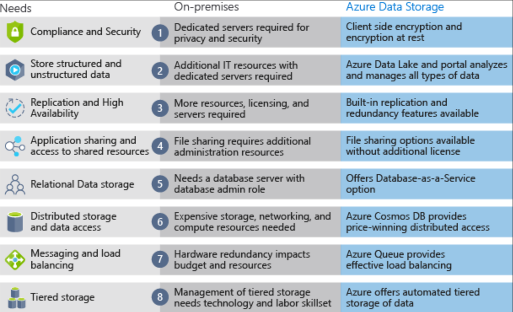

Azure Storage

#### Types of data
There are three primary types of data that Azure Storage is designed to hold.

- **Structured data** (Relational Data) is data that adheres to a schema, so all of the data has the same fields or properties. Structured data can be stored in a database table with rows and columns. Structured data relies on keys to indicate how one row in a table relates to data in another row of another table. 
- **Semi-structured** (NoSQL Data) data doesn't fit neatly into tables, rows, and columns. Instead, semi-structured data uses tags or keys that organize and provide a hierarchy for the data.
- **Unstructured data** encompasses data that has no designated structure to it. This lack of structure also means that there are no restrictions on the kinds of data it can hold. For example, a blob can hold a PDF document, a JPG image, a JSON file, video content, etc.

***
#### Storage solutions

- **Azure SQL Database** is a relational database as a service (DaaS) based on the latest stable version of the Microsoft SQL Server database engine. You can migrate your existing SQL Server databases with minimal downtime using the Azure Database Migration Service. The service uses the Microsoft Data Migration Assistant to generate assessment reports that provide recommendations to help guide you through required changes prior to performing a migration.
- **Azure Cosmos DB** is a globally distributed database service. It supports schema-less data that lets you build highly responsive and Always On applications to support constantly changing data.
- **Azure Blob Storage** is unstructured, meaning that there are no restrictions on the kinds of data it can hold. Blobs are highly scalable and apps work with blobs in much the same way as they would work with files on a disk, such as reading and writing data.Blobs aren't limited to common file formats. A blob could contain gigabytes of binary data.
- **Azure Data Lake Storage** combines the scalability and cost benefits of object storage with the reliability and performance of the Big Data file system capabilities. 
- **Azure Files** offers fully managed file shares in the cloud that are accessible via the industry standard *Server Message Block (SMB) protocol*. Azure file shares can be mounted concurrently by cloud or on-premises deployments of Windows, Linux, and macOS. pplications running in Azure virtual machines or cloud services can mount a file storage share to access file data, just as a desktop application would mount a typical SMB share. 
- **Azure Queue** storage is a service for storing large numbers of messages that can be accessed from anywhere in the world. 
Azure Queue Storage can be used to help build flexible applications and separate functions for better durability across large workloads. When application components are decoupled, they can scale independently. Queue storage provides asynchronous message queueing for communication between application components, whether they are running in the cloud, on the desktop, on-premises, or on mobile devices. Typically, there are one or more sender components and one or more receiver components. Sender components add messages to the queue, while receiver components retrieve messages from the front of the queue for processing.
- **Disk storage** provides disks for virtual machines, applications, and other services to access and use as they need, similar to how they would in on-premises scenarios. Disk storage allows data to be persistently stored and accessed from an attached virtual hard disk. ypical scenarios for using disk storage are if you want to lift and shift applications that read and write data to persistent disks, or if you are storing data that is not required to be accessed from outside the virtual machine to which the disk is attached.

***
#### Configurations

Azure offers three **storage tiers** for blob object storage:

- *Hot storage tier*: optimized for storing data that is accessed frequently.
- *Cool storage tier*: optimized for data that are infrequently accessed and stored for at least 30 days.
- *Archive storage tier*: for data that are rarely accessed and stored for at least 180 days with flexible latency requirements.

Azure provides **security** and **high availability** to your data through encryption and replication features.The following encryption types are available for your resources:
- **Azure Storage Service Encryption (SSE)** for data at rest helps you secure your data to meet the organization's security and regulatory compliance. It encrypts the data before storing it and decrypts the data before retrieving it. The encryption and decryption are transparent to the user.
- **Client-side encryption** is where the data is already encrypted by the client libraries. Azure stores the data in the encrypted state at rest, which is then decrypted during retrieval.

***
#### Cloud vs On Premise storage
The following illustration shows differences between on-premises storage and Azure data storage.

