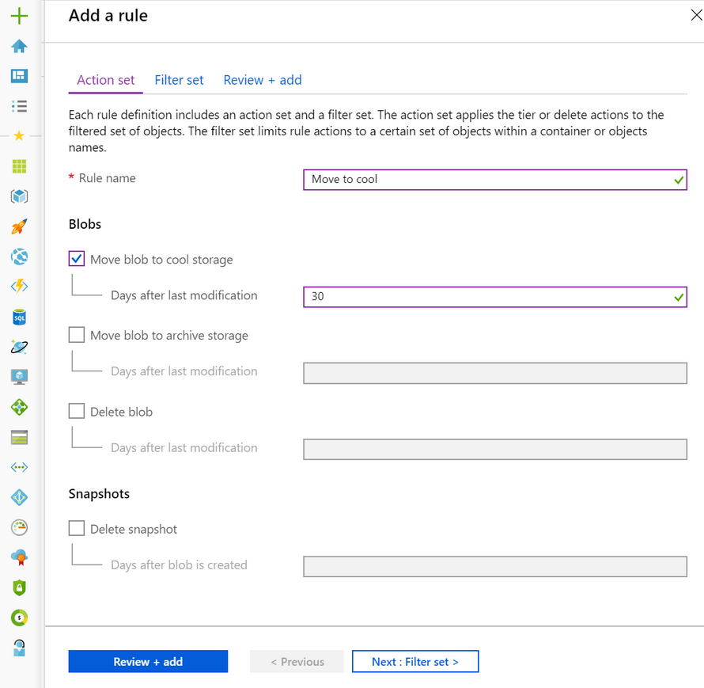

Data Lifecycle

Data sets have unique lifecycles. Early in the lifecycle, people access some data often. But the need for access drops drastically as the data ages. Some data stays idle in the cloud and is rarely accessed once stored. Some data expires days or months after creation, while other data sets are actively read and modified throughout their lifetimes. Azure Blob storage lifecycle management offers a rich, rule-based policy for GPv2 and Blob storage accounts. Use the policy to transition your data to the appropriate access tiers or expire at the end of the data's lifecycle.

The lifecycle management policy lets you:
- Transition blobs to a cooler storage tier (hot to cool, hot to archive, or cool to archive) to optimize for performance and cost
- Delete blobs at the end of their lifecycles
- Define rules to be run once per day at the storage account level
- Apply rules to containers or a subset of blobs (using prefixes as filters)

