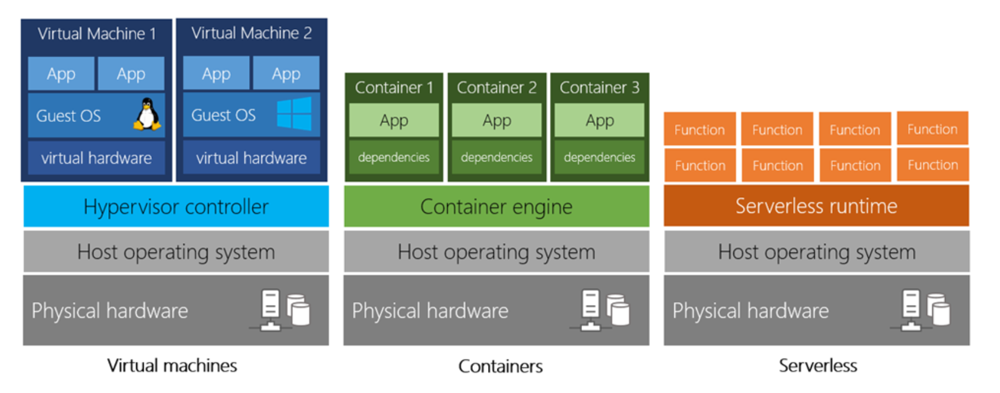
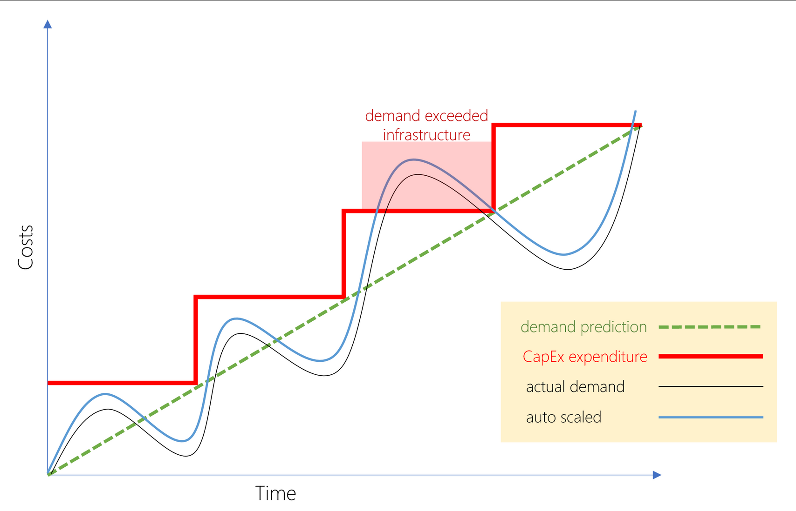
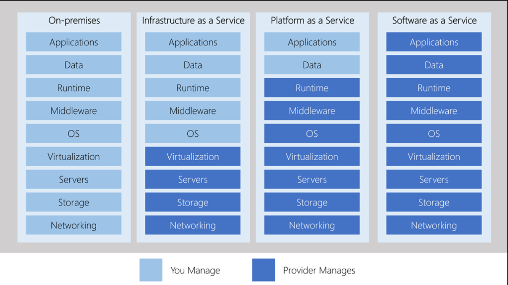

Principles of cloud

Every business has different needs and requirements. Cloud computing is flexible and cost-efficient, which can be beneficial to every business, whether it's a small start-up or a large enterprise.

Containers provide a consistent, isolated execution environment for applications. They're similar to VMs except they don't require a guest operating system. 

Serverless computing lets you run application code without creating, configuring, or maintaining a server. The core idea is that your application is broken into separate functions that run when triggered by some small action. The serverless model differs from VMs and containers in that you only pay for the processing time used by each function as it executes. VMs and containers are charged while they're running - even if the applications on them are idle.
* * *
Cloud is:
- Cost effective
- Scalable (both horizontal and vertical)
- Elastic
- Current (no maintenance)
- Reliable
- Global
- Secure
- Compliant

* * *
Cloud removes CapEx investment requirements to start a business:

OpEx is particularly appealing if the demand fluctuates or is unknown. Cloud services are often said to be agile. Cloud agility is the ability to rapidly change an IT infrastructure to adapt to the evolving needs of the business.

* * *
#### Private vs Public vs Hybrid cloud (not to confuse with multi-cloud)
In a private cloud, you create a cloud environment in your own datacenter and provide self-service access to compute resources to users in your organization.

* * *
#### Iaas, Paas, Saas

