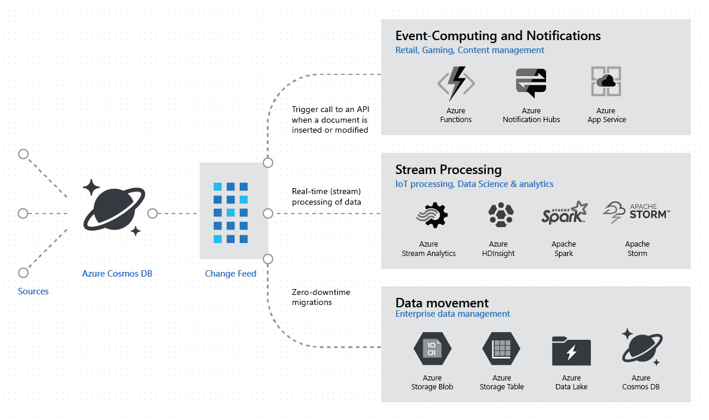
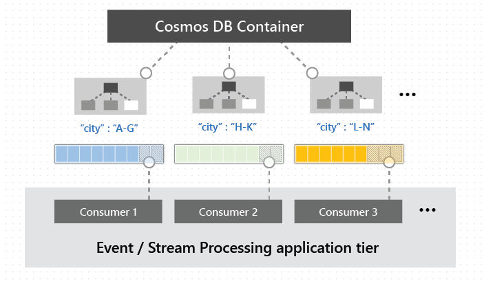

Change Feeds

Change feed support in Azure Cosmos DB works by listening to an Azure Cosmos container for any changes. It then outputs the sorted list of documents that were changed in the order in which they were modified. The changes are persisted, can be processed asynchronously and incrementally, and the output can be distributed across one or more consumers for parallel processing.  A common design pattern in these applications is to use changes to the data to trigger additional actions. Examples of additional actions include:

- Triggering a notification or a call to an API, when an item is inserted or updated.
- Real-time stream processing for IoT or real-time analytics processing on operational data.
- Additional data movement by either synchronizing with a cache or a search engine or a data warehouse or archiving data to cold storage.

At this point, it's only supported through the SQL and Gremlin APIs. 

Some examples in architecture:

**Cosmos as Event hub**

- ComsosDB as Hot data store with change feed updating cold data stores
- Update other CosmosDB databases with different partition keys

https://docs.microsoft.com/en-us/azure/cosmos-db/change-feed
