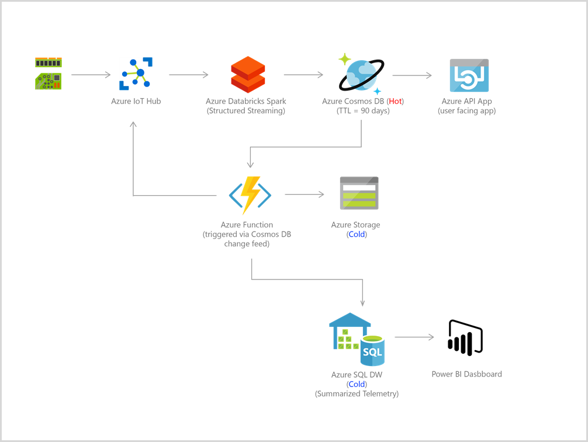
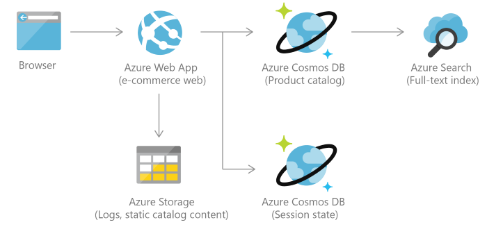
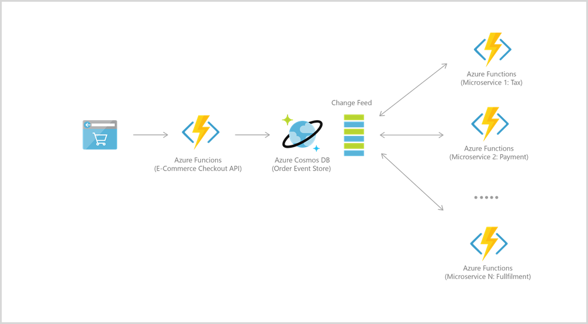

Use Cases

CosmosDB as IoT-backend hot storage (with TTL) and cold storage that is updated via change feed + event driven services.

CosmosDB as website backend for products that have frequently changing properties/ schemas. Change feed updates search algorithms/ recommendation algorithms based on user events. 

CosmosDB as persistent event hub (store).  Keywords: downstream, incrementally, change feed, persistent event store (where-as event hub is not persistent)

