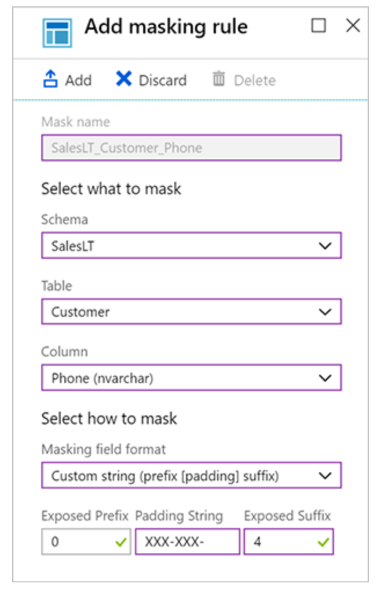

Data Access

#### Database Data Masking
Dynamic data masking is a policy-based security feature that hides the sensitive data in the result set of a query over designated database fields, while the data in the database is not changed.

Data masking rules consist of the column to apply the mask to, and how the data should be masked. Data masking is done at database level and from the portal. 

#### Masking options:

- **Default Value**: Default value, which displays the default value for that data type instead
- **Custom**: Basically replacing a substring with characters. Which allows you to set the number of characters exposed from the start of the data, the number of characters exposed from the end of the data, and the characters to repeat for the remainder of the data.
- **Email**: Hides the **domain name** and **all but the first character** of the email account name.
- **Credit Card**: Which only shows **the last four digits** of the number
- **Random number**: Which specifies a random number between a range of values. 

https://docs.microsoft.com/nl-nl/azure/sql-database/sql-database-dynamic-data-masking-get-started
***
### RLS
Row-Level Security enables you to use group membership or execution context to control access to rows in a database table.

Row-Level Security (RLS) simplifies the design and coding of security in your application. RLS helps you implement restrictions on data row access. For example, you can ensure that workers access only those data rows that are pertinent to their department. Another example is to restrict customers' data access to only the data relevant to their company.

The access restriction logic is located in the database tier rather than away from the data in another application tier. The database system applies the access restrictions every time that data access is attempted from any tier. This makes your security system more reliable and robust by reducing the surface area of your security system.

LS supports two types of security predicates.

- Filter predicates silently filter the rows available to read operations (SELECT, UPDATE, and DELETE).
- Block predicates explicitly only block write operations

https://docs.microsoft.com/en-us/sql/relational-databases/security/row-level-security?view=sql-server-ver15
***
### When to use what?
Use Dynamic Data masking if specific fields should be masked and in a specific manner. Use RLS to simply restrict access to entire records based on a field value. Use regular database roles to restrict access to larger structures (entire tables, schemas)