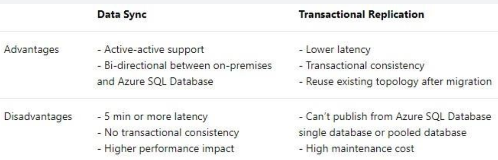

Data Syncing

Azure offers **Data Sync** as a synhronization solution. Data Sync is based around the concept of a Sync Group. A Sync Group is a group of databases that you want to synchronize. It is **not** the same as Replication as it is not often used for high availability purposes. It is more often used for low latency purposes or something else.

Data Sync uses a hub and spoke topology to synchronize data. You define one of the databases in the sync group as the Hub Database. The rest of the databases are member databases. Sync occurs only between the Hub and individual members.

A sync group consists of the following databases:
- The Hub Database **must be an Azure SQL Database**.
- The member databases can be either SQL Databases, on-premises SQL Server databases, or SQL Server instances on Azure virtual machines.
- The Sync Database contains the **metadata** and log for Data Sync. The Sync Database has to be an Azure SQL Database located in the same region as the Hub Database. The Sync Database is customer created and customer owned. Often you create a new DB for this.

A Sync Group has the following properties:
- The Sync Schema describes which data is being synchronized.
- The Sync Direction **can be bi-directional** or can flow in only one direction. That is, the Sync Direction can be *Hub to Member*, or *Member to Hub*, *or both.*
- The Sync Interval describes how often synchronization occurs.
- The Conflict Resolution Policy is a group level policy, which can be Hub wins or Member wins.

https://docs.microsoft.com/nl-nl/azure/sql-database/sql-database-firewall-configure

***
**Transactional Replication** syncs two SQL databases (cloud/ cloud or prem/ cloud) and can also be used to migrate a DB. It first creates a seed and then updates transactions as they come. Can be used to isolate an on-prem DB and allow user-access to a replicated cloud DB. It's supported from SQL Server itself. Is not bi-directional, can't use Azure SQL as source.

https://docs.microsoft.com/nl-nl/azure/sql-database/sql-database-managed-instance-transactional-replication

***
**Stretch Database** is an on-prem SQL Server functionality that can be used to migrate cold data from tables in one DB to another. It's likely not in scope.

***
### When to use what?
Determine if syncing is bi-directional (Data Sync) or not, and whether to use existing schema's/ topology (TransRep).

