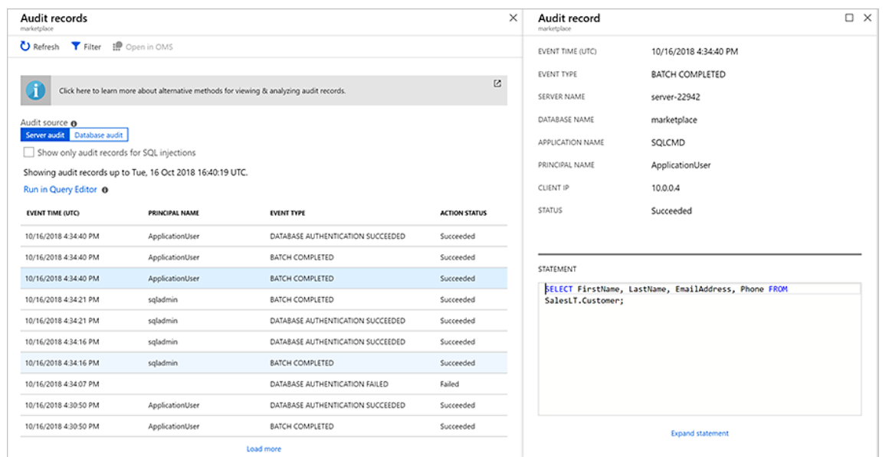

Monitoring

There are several solutions in place for SQL monitoring:

- Automatic Tuning
- SQL Analytics
- Query Performance Insights
- Intelligent Performance Insight
- Performance Recommendations
- Metrics and Logging

#### Metrics
**Manually enable** the metrics and diagnostics in Azure SQL DB OR Elastic Pool to collect the following telemetry:
- Basic metrics (resource consumption, connections, storage)
- QueryStoreRuntimeStatistics
- QueryStoreWaitStatistics
- Errors
- Blocks

***
### Database Auditing
First, Database auditing =/= not the same as *Advanced Data Security*. Auditing is required when you want to use the extra option threat detection.

By enabling auditing, operations that occur on the database are stored for later inspection or to have automated tools analyze them. **This is usefull if you have tables with sensistive data and you want to monitor access to these tables.**

Audit logs are written to Append Blobs in an Azure Blob storage account that you designate. Audit policies can be applied at the server-level or database-level. Once enabled, you can use the Azure portal to view the logs, or send them to Log Analytics or Event Hub for further processing and analysis. Auditing can be done at server level and at database level. 
You can output it to Storage, Event Hubs or Log Analytics. 

https://docs.microsoft.com/nl-nl/azure/sql-database/sql-database-auditing

