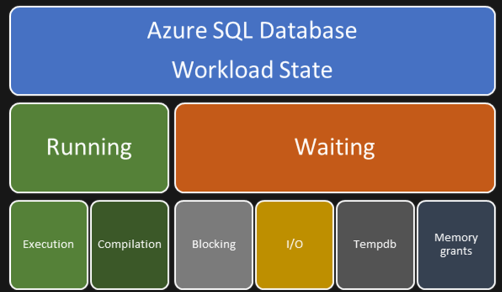
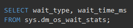

Performance Tuning

To diagnose and resolve performance problems, begin by finding out the state of each active query and the conditions that cause performance problems relevant to each workload state. To improve Azure SQL Database performance, you need to understand that each active query request from the application is in either a running state or a waiting state. As you troubleshoot a performance problem in Azure SQL Database, keep the following diagram in mind.

**
## Troubleshooting Running-related problems
As a general guideline, if CPU usage is consistently at or above 80 percent, your performance problem is running-related. A running-related problem might be caused by insufficient CPU resources. Or it might be related to one of the following conditions:

- Too many running queries
- Too many compiling queries
- Compilation problems: One or more executing queries that use a suboptimal query plan. 
    - **Parameter sensitive plan problems**. A parameter sensitive plan (PSP) problem happens when the query optimizer generates a query execution plan that's optimal only for a specific parameter value (or set of values) and the cached plan is then not optimal for parameter values that are used in consecutive executions.
    - **Compile activity caused by improper parameterization**. When a query has literals, either the database engine automatically parameterizes the statement or a user explicitly parameterizes the statement to reduce the number of compilations. A high number of compilations for a query using the same pattern but different literal values can result in high CPU usage.
    - **Factors that affect query plan changes** A query execution plan recompilation might result in a generated query plan that differs from the original cached plan. SQL Query Optimizer might produce a suboptimal plan because of stale statistics, an incorrect estimate of the number of rows to be processed, or an inaccurate estimate of required memory. 
    
1. Check if problems are running related (>80% CPU utilization)
2. Check if too many queries/ compilations or improper compilations
3. Use DMV, Auto Tuning, Statistics or extra resources to optimize query plans

https://docs.microsoft.com/en-us/azure/sql-database/sql-database-monitor-tune-overview
***
#### Dynamic Management Views
Dynamic management views and functions return server state information that can be used to monitor the health of a server instance, diagnose problems, and tune performance. There are two types of dynamic management views and functions:
- Server-scoped dynamic management views and functions. These require VIEW SERVER STATE permission on the server.
- Database-scoped dynamic management views and functions. These require VIEW DATABASE STATE permission on the database.

All dynamic management views and functions exist in the sys schema and follow this naming convention dm_*. When you use a dynamic management view or function, you must prefix the name of the view or function by using the sys schema. For example, to query the dm_os_wait_stats dynamic management view, run the following query:

#### Query Performance Insight

Managing and tuning the performance of relational databases takes expertise and time. Query Performance Insight is a part of the Azure SQL Database intelligent performance product line. It helps you spend less time troubleshooting database performance by providing:

- Deeper insight into your databases resource (DTU) consumption.
- Details on top database queries by CPU, duration, and execution count (potential tuning candidates for performance improvements).
- The ability to drill down into details of a query, to view the query text and history of resource utilization.
- Annotations that show performance recommendations from SQL Database Advisor.

Query Performance Insight offers a dashboard experience on top of the query store. It breaks down resource consumption, duration and frequency per query and offer query deep dives and performance recommendations (via SQL database advisor). **For basic performance monitoring with Azure SQL Database, we recommend Query Performance Insight.**

https://docs.microsoft.com/en-us/azure/sql-database/sql-database-query-performance

***
#### SQL Database Advisor (not on managed instance)

Azure SQL Database learns and adapts with your application. It provides customized recommendations that enable you to maximize the performance of your SQL databases. SQL Database continuously assesses and analyzes the usage history of your SQL databases. The recommendations that are provided are based on database-unique workload patterns and help improve performance. Typical recommendations:
- Create index recommendations
- Drop index recommendations
- Parameterize queries recommendations
- Fix schema issues recommendations

https://docs.microsoft.com/en-us/azure/sql-database/sql-database-advisor

***
#### Automatic Tuning (not on managed instance)

Automatic tuning is a fully managed intelligent performance service that uses built-in intelligence to continuously monitor queries executed on a database, and it automatically improves their performance. This is achieved through dynamically adapting database to the changing workloads and applying tuning recommendations. Automatic tuning learns horizontally from all databases on Azure through AI and it dynamically improves its tuning actions during low peak moments. The longer an Azure SQL Database runs with automatic tuning on, the better it performs.

https://docs.microsoft.com/en-us/azure/sql-database/sql-database-automatic-tuning
