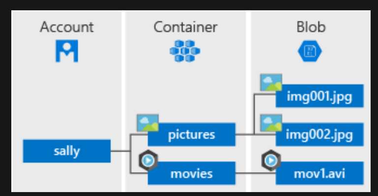

Access management

There are three ways of providing access:
- Access keys provide access at account level
- SAS Tokens can be generated for time-limited access to an account, container or blobs
- RBAC Access gives AD access to an account
- Anonymous access can be given to containers and blobs

***
**Grant anonymous users permissions to containers and blobs**

By default, a container and any blobs within it may be accessed only by a user that has been given appropriate permissions. To grant anonymous users read access to a container and its blobs, you can set the container public access level. When you grant public access to a container, then anonymous users can read blobs within a publicly accessible container without authorizing the request.

You can configure a container with the following permissions:

- No public read access: The container and its blobs can be accessed only by the storage account owner. This is the default for all new containers.
- Public read access for blobs only: Blobs within the container can be read by anonymous request, but container data is not available. Anonymous clients cannot enumerate the blobs within the container.
- Public read access for container and its blobs: All container and blob data can be read by anonymous request. Clients can enumerate blobs within the container by anonymous request, but cannot enumerate containers within the storage account.

https://docs.microsoft.com/nl-nl/azure/storage/blobs/storage-manage-access-to-resources

***
#### SAS tokens
There are multiple types of SAS tokens. 

- You can use a **service-level** shared access signature to allow *access to specific resources* in a storage account. You'd use this type of shared access signature, for example, to allow an app to retrieve a list of files in a file system or to download a file.
- Use an **account-level** shared access signature to allow *access to anything that a service-level shared access signature can allow, plus additional resources and abilities*.