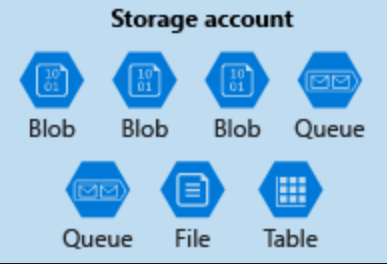

Azure Storage

#### Creating a storage account
A storage account is a container that groups a set of Azure Storage services together. Only data services from Azure Storage can be included in a storage account (Azure Blobs, Azure Files, Azure Queues, and Azure Tables). The following illustration shows a storage account containing several data services.

A storage account represents a collection of settings like **location, replication strategy, and subscription owner**. You need one storage account for every group of settings that you want to apply to your data. 

