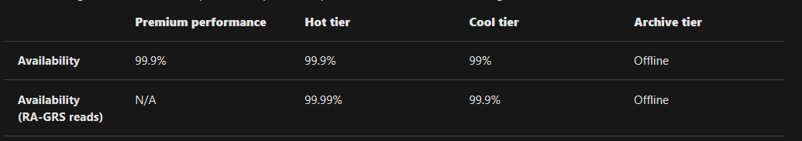

Tiers

***
## Available Access Tiers
Azure storage offers different access tiers, which allow you to store blob object data in the most cost-effective manner. The available access tiers include:

- Premium - Optimized for workloads that require very fast response times and/or high transactions rates with smaller blob sizes.
- Hot - Optimized for storing data that is accessed frequently.
- Cool - Optimized for storing data that is infrequently accessed and stored for at least 30 days.
- Archive - Optimized for storing data that is rarely accessed and stored for at least 180 days with flexible latency requirements (on the order of hours).

***
The **hot** access tier has higher storage costs than cool and archive tiers, but the lowest access costs. Example usage scenarios for the hot access tier include:
- Data that's in active use or expected to be accessed (read from and written to) frequently.
    
The **cool** access tier has lower storage costs and higher access costs compared to hot storage. This tier is intended for data that will remain in the cool tier for **at least 30 days**. Example usage scenarios for the cool access tier include:
- Short-term backup and disaster recovery datasets.
- Older media content not viewed frequently anymore but is expected to be available immediately when accessed.
- Large data sets that need to be stored cost effectively while more data is being gathered for future processing.

The **archive** access tier has the lowest storage cost. But it has higher data retrieval costs compared to the hot and cool tiers. Data in the archive tier can take several hours to retrieve. This is because Archive data is stored offline in Microsoft data centers and a countainer needs to be "rehydrated" before blobs available for read. Data must remain in the archive tier for **at least 180 days** or be subject to an early deletion charge.

Example usage scenarios for the archive access tier include:
- Long-term backup, secondary backup, and archival datasets
- Original (raw) data that must be preserved, even after it has been processed into final usable form.

***
#### Setting an Access Tier
Blobs in all three access tiers can coexist within the same account. Any blob that doesn't have an explicitly assigned tier infers the tier from the account access tier setting. Blob-level tiering allows you to change the tier of your data at the object level using a single operation called Set Blob Tier. You can easily change the access tier of a blob among the hot, cool, or archive tiers as usage patterns change, without having to move data between accounts. 

The following considerations apply to the different access tiers:

- Only the hot and cool access tiers can be set at the account level. The archive access tier isn't available at the account level.
- Hot, cool, and archive tiers can be set at the blob level.

***
#### Blob Lifecycle Management
Blob Storage lifecycle management offers a rich, rule-based policy that you can use to transition your data to the best access tier and to expire data at the end of its lifecycle. The lifecycle management policy lets you:

- Transition blobs to a cooler storage tier (hot to cool, hot to archive, or cool to archive) to optimize for performance and cost
- Delete blobs at the end of their lifecycles
- Define rules to be run once per day at the storage account level
- Apply rules to containers or a subset of blobs (using prefixes as filters)
