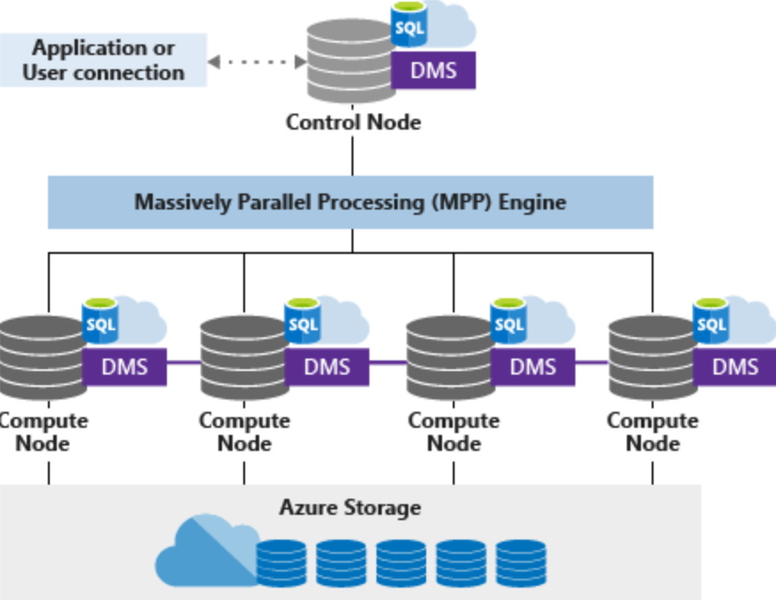

Architecture

***
#### Architecture
Synapse Analytics uses a node-based architecture. Applications connect and issue T-SQL commands to a control node, which is the single point of entry for the data warehouse. The control node runs the massively parallel processing (MPP) engine, which optimizes queries for parallel processing. Then, it passes operations to compute nodes to do their work in parallel. Compute nodes store all user data in Azure Storage and run parallel queries. DMS is the data transport technology that coordinates data movement between compute nodes. When SQL Data Warehouse runs a query, the work is divided into 60 smaller queries that run in parallel. Each of the 60 smaller queries runs on one of the underlying data distributions.

https://docs.microsoft.com/nl-nl/azure/sql-data-warehouse/massively-parallel-processing-mpp-architecture 