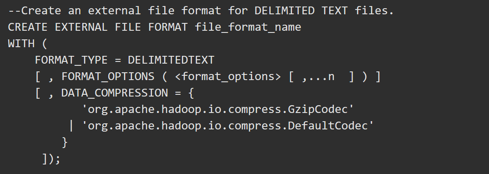

External Data 

**External Sources**
DWH uses polybase to load data. Polybase was introduced in SQL Server 2016 and supports the following data sources:
- HDFS
- Azure Blob Storage
- SQL Server
- Oracle
- MongoDB or CosmosDB
- ODBC
- Bulk (HTTPS)

***
**File formats**
PolyBase supports the following file formats:

- Delimited Text
- Hive RCFile
- Hive ORC
- Parquet

The example below shows DELIMITEDTEXT with extra compression options such as Gzip. Compression like this is often used in HDFS.

