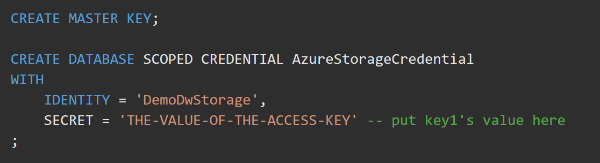
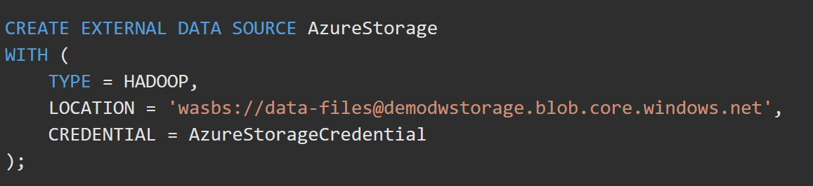
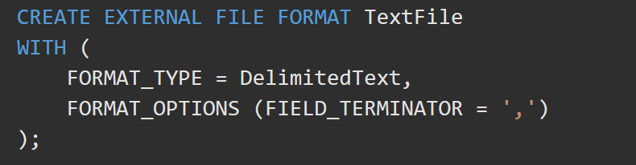
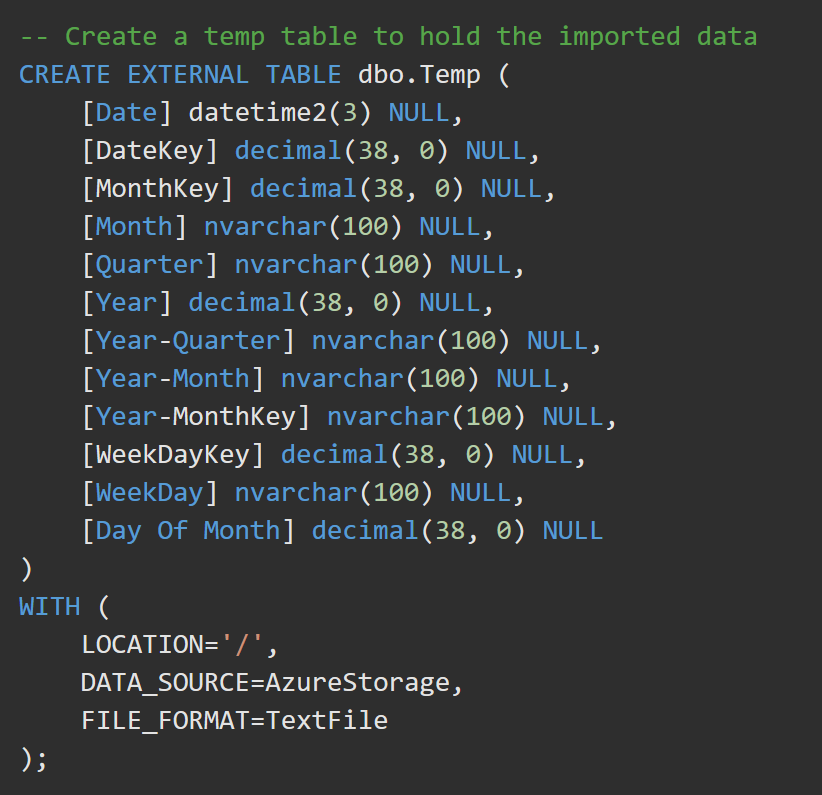
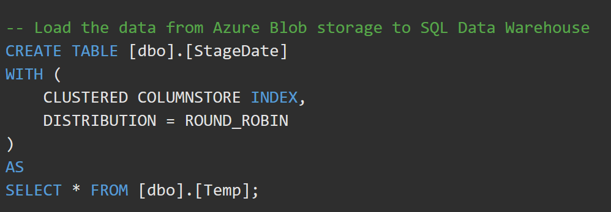
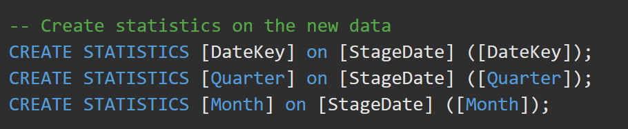

Polybase

#### Polybase
PolyBase is a technology that accesses and combines both non-relational and relational data, all from within SQL Server or Azure DWH. It allows you to run queries on external data in Hadoop or Azure blob storage. The queries targetted on HDFS sources are optimized to push computation to Hadoop. Polybase is therefore very useful to join tables together that reside in different sources, suchs as Azure Storage, ADLS or Azure SQL. 

1. Create Master Key (encrypts secrets inside DB)
2. Create Database Scoped Credential (Name, Pw)
3. Create External Data Source (Type, Url, Credential)
4. Create File Format (Type, Format Options)
5. Create External Table (Data Source, Data Source Path, File Format)
6. Create Local Table and load it in one command:
    CREATE TABLE ()
    WITH ()
    AS
    SELECT * FROM External_Table

Codewise, it's very similar to using external tables in SQL. Some of the steps *example with using a CSV file in Azure Storage*:
- **Define a database scoped credential**

- **Define an external data source **targetting storage (that in turn references the connection object)

- **Define the external file format** named TextFile. This name indicates to PolyBase that the format of the text file is DelimitedText and the field terminator is a comma.

- **Create an external table with reject values** (named dbo.temp) with the column definition for your table. At the bottom of the query, use a WITH clause to call the data source definition named AzureStorage, as previously defined, and the file format named TextFile, as previously defined. The location denotes that the files for the load are in the root folder of the data source. A data record is considered dirty if its data types or the number of columns don't match the column definitions of the external table. You can specify reject parameters that determine how PolyBase will handle dirty records it retrieves from the external data source:
    - *REJECT_TYPE* = value | percentage. Specifies whether the REJECT_VALUE option is specified as a literal value or a percentage.
        - *REJECT_VALUE*. If REJECT_TYPE is value, the PolyBase query will fail when the number of rejected rows exceeds 0 
        - *REJECT_VALUE*. If REJECT_TYPE is percentage, the PolyBase query will fail when the percentage of failed rows exceeds REJECT_VALUE. The percentage of failed rows is calculated at intervals.
- 
- Create a physical table in the SQL Data Warehouse database. In the following example, you create a table named dbo.StageDate. The table has a clustered column store index defined on all the columns. It uses a table geometry of round_robin by design because round_robin is the best table geometry to use for loading data.

***
CTAS **(CREATE TABLE AS SELECT)** is a parallel operation that creates a new table based on the output of a SELECT statement. CTAS is the simplest and fastest way to create and insert data into a table with a single command.  Let's say you originally created your table as ROUND_ROBIN, and now want to change it to a table distributed on a column. CTAS is how you would change the distribution column. You can also use CTAS to change partitioning, indexing, or column types.

***
- Optionally add some statistics to improve query performance
