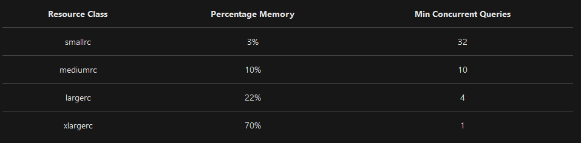

Resource Classes

The performance capacity of a query is determined by the user's resource class. Resource classes are pre-determined resource limits in Azure SQL Data Warehouse that govern compute resources and concurrency for query execution. Resource classes can help you manage your workload by setting limits on the number of queries that run concurrently and on the compute-resources assigned to each query. There's a trade-off between memory and concurrency.

- Smaller resource classes reduce the maximum memory per query, but increase concurrency.
- Larger resource classes increase the maximum memory per query, but reduce concurrency.

There are two types of resource classes:

- Static resources classes, which are well suited for increased concurrency on a data set size that is fixed.
- Dynamic resource classes, which are well suited for data sets that are growing in size and need increased performance as the service level is scaled up.

#### Adding a user to a resource class
Resource classes are implemented by assigning users to database roles. When a user runs a query, the query runs with the user's resource class. For example, if a user is a member of the staticrc10 database role, their queries run with small amounts of memory. If a database user is a member of the xlargerc or staticrc80 database roles, their queries run with large amounts of memory.

https://docs.microsoft.com/nl-nl/azure/sql-data-warehouse/resource-classes-for-workload-management