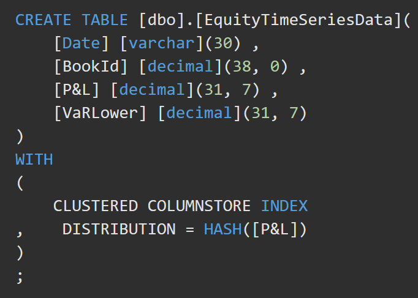
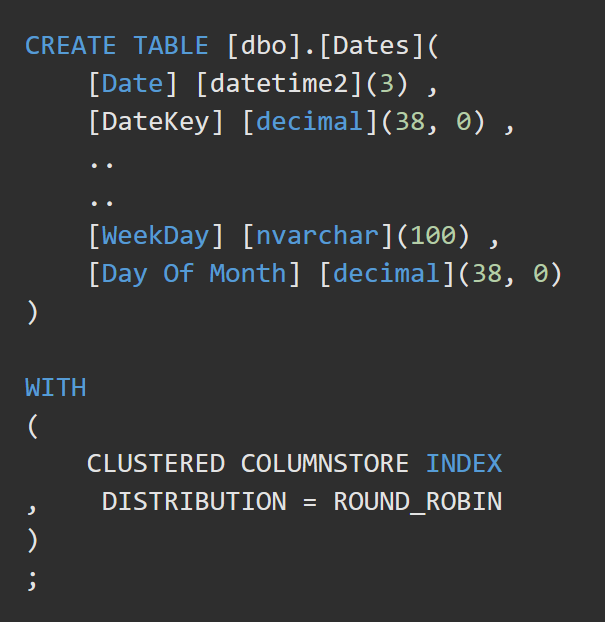

Table Distributing

#### Azure DWH Data Sharding
Synapse Analytics uses Azure Storage to keep user data safe. Because data is stored and managed by Azure Storage, SQL Data Warehouse charges separately for storage consumption. The data is sharded into **distributions** to optimize system performance. When you define the table, you can choose which sharding pattern to use to distribute the data. Synapse Analytics supports these sharding patterns:

- Hash (Hashes on a value in a specific column, for large tables)
- Round Robin (Default, random best effort distribution)
- Replication (Replication of entire tables, for small tables)

        CREATE TABLE ()
        WITH (
        ClUSTERED COLUMNSTORE INDEX,
        DISTRIBUTION = HASH([ColumnName])
        )

***
Choose a distribution column with data that distributes evenly

For best performance, all of the distributions should have approximately the same number of rows. When one or more distributions have a disproportionate number of rows, some distributions finish their portion of a parallel query before others. Since the query can't complete until all distributions have finished processing, each query is only as fast as the slowest distribution.

- Data skew means the data is not distributed evenly across the distributions
- Processing skew means that some distributions take longer than others when running parallel queries. This can happen when the data is skewed.

To balance the parallel processing, select a distribution column that:
- *Has many unique values.* The column can have some duplicate values. However, all rows with the same value are assigned to the same distribution. Since there are 60 distributions, the column should have at least 60 unique values. Usually the number of unique values is much greater.
- *Does not have NULLs, or has only a few NULLs.* For an extreme example, if all values in the column are NULL, all the rows are assigned to the same distribution. As a result, query processing is skewed to one distribution, and does not benefit from parallel processing.
- *Is not a date column.* All data for the same date lands in the same distribution. If several users are all filtering on the same date, then only 1 of the 60 distributions do all the processing work.

***
#### Distribution Options
**Hash**: A hash-distributed table can deliver the highest query performance for joins and aggregations on large tables.

To shard data into a hash-distributed table, SQL Data Warehouse uses a *hash function to assign each row to one distribution deterministically*. In the table definition, one of the columns is designated the distribution column. The hash function uses the values in the distribution column to assign each row to a distribution. Don't hash on a VARCHAR though.

**Round-robin**: A round-robin table is the most straightforward table you can use to create and deliver fast performance in a staging table for loads.

A round-robin distributed table distributes data evenly across the table but without additional optimization. A distribution is first chosen at random. Then, buffers of rows are assigned to distributions sequentially. Loading data into a round-robin table is quick, but query performance often is better in hash-distributed tables. Joins on round-robin tables require reshuffling data and this takes more time.

**Replicated**: A replicated table provides the fastest query performance for small tables.

A table that is replicated caches a full copy on each compute node. Consequently, replicating a table removes the need to transfer data among compute nodes before a join or aggregation. Replicated tables work best in small tables. Extra storage is required, and additional overhead is incurred when writing data, which make large tables impractical. Since the table has multiple copies, replicated tables work best when the table size is less than 2 GB compressed. 2 GB is not a hard limit. If the data is static and does not change, you can replicate larger tables.

