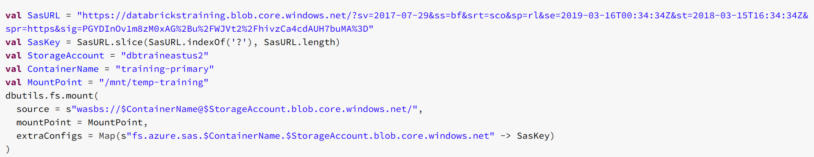
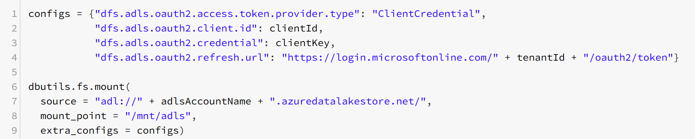
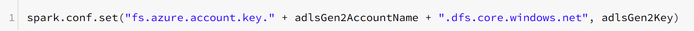
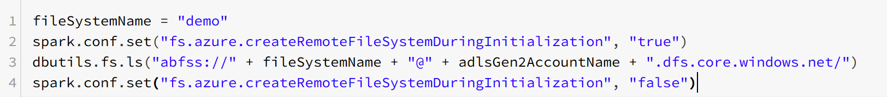
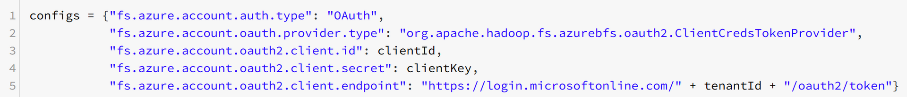
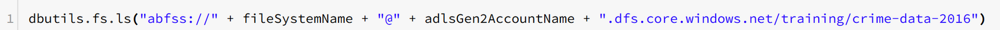

Authentication methods

# Accessing a filesystem in Databricks

All local paths refer to the DataBricks File System. When mounting a filesystem, we can use any DataBricks function to access external storage as if it were local. 

## Blob Storage (SAS tokens)
Azure provides you with a secure way to create and share access keys for your Azure Blob Store without compromising your account keys. 
1. Select Shared access signature from the blob storage portal menu.
2. Click the Generate SAS button.
3. Copy the entire Blog service SAS URL to the clipboard.
4. Use the URL in the mount operation, as shown below.

In essense, this provides you with a pathlink and connection credentials similar to using a shared key. 

## ADLSgen1 (Mounting via Service Principal)
A service principal is an identity that is used by a service or application. And like other identities, it can be assigned roles.

- **Create a Service Principal** ADLS uses Azure Active Directory for authentication. To provide access to your ADLS instance from Azure Databricks, you will use [service-to-service authentication](https://docs.microsoft.com/en-us/azure/data-lake-store/data-lake-store-service-to-service-authenticate-using-active-directory). For this, you need to create an identity in Azure Active Directory (Azure AD) known as a service principal. Once a Service Principal is created, we can use it via the client ID and client key. 
- **Assign permissions to Service Principal** Next, you need to assign the required permissions to the service principal in ADLS. This does not only means RBAC access to the ADLS resource, but also File System permissions inside the ADLS hierarchical file system. 
- **Configure connection in Databricks**Azure Active Directory offers multiple authentication protocals. To perform authentication using the service principal account, Databricks uses OAUTH2. For this, you need to provide your Azure AD Tenant ID to DataBricks (it can be found in the Active Directory Tab). All of the settings can be recorded in a config which can then be used to mount the filesystem inside DataBricks. 

## ADLSgen2
There are three supported methods for connecting Databricks to ADLS Gen2:

1. Direct access with a Shared Key 
2. Direct access with OAuth.
3. Mounting using OAuth.

### Direct access with a Shared key
Since ADLSgen2 is using Azure Blob Storage as foundation, a Shared Key can be used in conjunction with the Account name to achieve direct access. 

### Direct access with OAuth
OAuth can also be used for direct access. This requires you to setup a Service Principal and provide access to ADLS to that Service Principal. Once that is setup, you can configure the spark application session to use OAuth. 

### Mounting with OAuth
Apart from dirrect access, you can mount the ADLS path to DBFS similar as ADLSgen1. 

## Databricks Scopes
Azure Databricks has two types of secret scopes: Key Vault-backed and Databricks-backed. These secret scopes allow you to store secrets, such as database connection strings, securely. If someone tries to output a secret to a notebook, it is replaced by `[REDACTED]`. This helps prevent someone from viewing the secret or accidentally leaking it when displaying or sharing the notebook.

### Key Vault Backed Scope
In DataBricks, you can create a [Scope](https://westeurope.azuredatabricks.net/#secrets/createScope) that essentially represents an Azure Key-Vault endpoint. Using this scope, you can specify a secrets-key (the name of the secret you stored in Key Vault) that is picked up from Key Vault at runtime. This key is also masked in print outs and the key is copied to clipboard. 

This key can be used in different ways, for example to connect to an Azure SQL instance via JDBC (the Java version of ODBC) directly within Spark. However, it can also be used to store the primary keys of Storage and Cosmos solutions in combination with a mounted file system, or direct access. 

