Delta API

# Scala Version
In the image below, we create a mock dataframe and save it as a Delta table in some arbritrary path. 
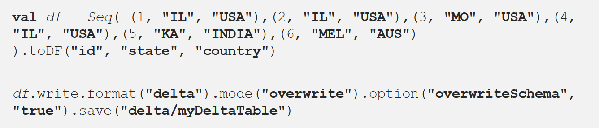

Now, we can load the data into df1 as a delta table. This allows us to use the Delta API.
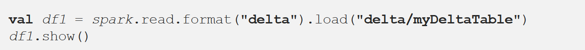

Delta uses versioned parquet files as it's file format. This allows us to query the state of the table either based on a timestamp or the Delta version number. Lets say we update the above dataframe by changing all letters in the Country column to lower case. The current table now looks like this:
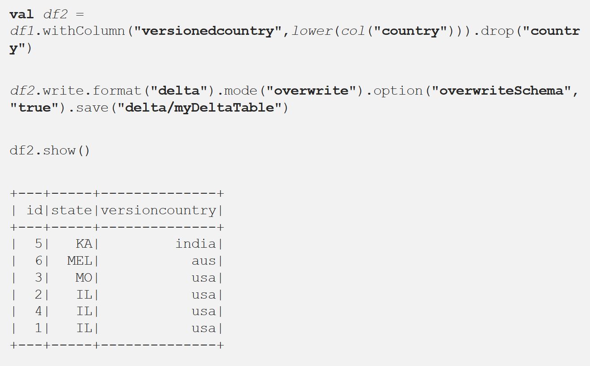

In Delta we can either provide a version number (versionAsOf) or a timestamp (timestampAsOf) to review a historic snapshot. In this case, we're interested in the initial table:
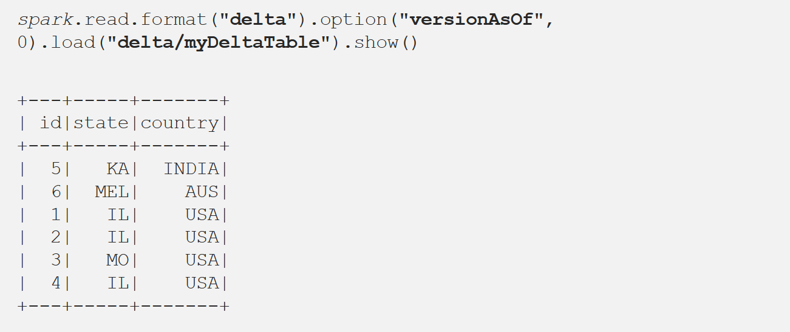

## Schema Validation
Lets say we get another similar df but with same different schema. Here everything is same but only the datatype of column id is StringType instead of IntegerType.
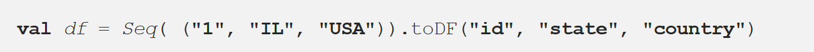

It will throw a schema exception on write:
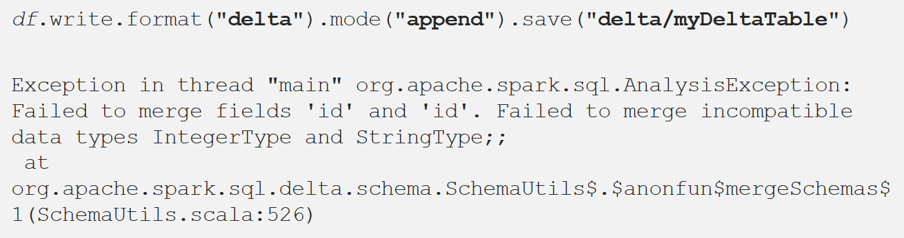

If there are any new columns in the data we want to append, it will throw an Analysis exception immediately.
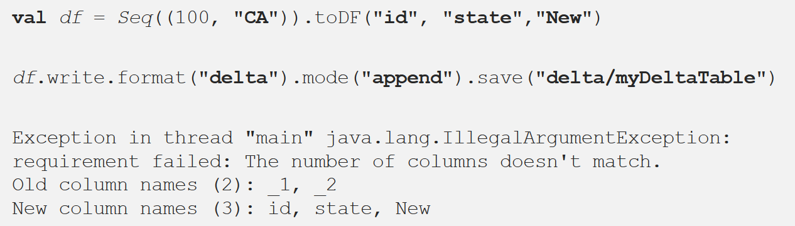

## Missing Data
When there is some missing data and the rest of the schema matches, that field is set to null.
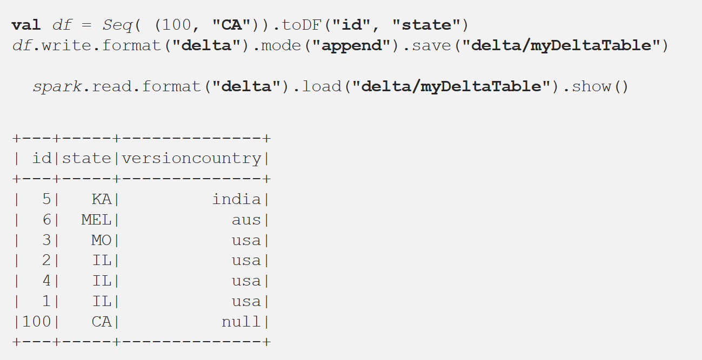

# Databricks Tutorial

## Creating a Delta table
As described above, first we create a raw table. We will use the PySpark API to read and write data between storage and a Spark dataframe, and SparkSQL API to create a **Delta Table**.

The Bronze table has the delta file format (instead of csv or parwuet) and we can partition it based on some column, with the same best practices as when we would partition Azure SQL or Cosmos DB. When we check the file system path, we will see that the partition created folders for each country. The image below shows the writing of a Spark DF to generic parquet and to Delta. 
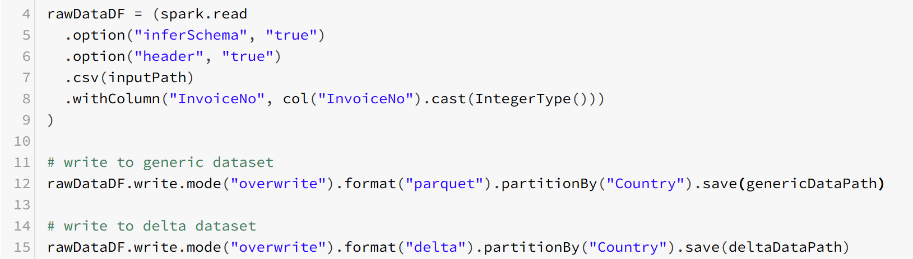

At this point, we are already Delta Lake. To add some SQL functionality we can use the SparkSQL API to load the delta files into a **data table**. 
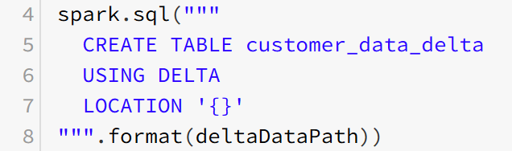

And now we can query on the table using SQL.
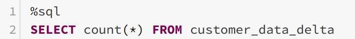

***
### Appending Data
We can append data using the PySpark API and the append mode. 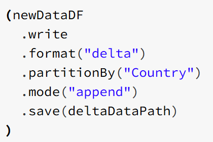

***
## Upserting data
Literally means "UPdate" and "inSERT". It means to atomically either insert a row, or, if the row already exists, UPDATE the row. The focus here is on the atomical part. In normal Spark, UPSERT is not a single atomic operation but TWO operations (UPDATE and INSERT). Running an UPDATE could invalidate data that is accessed by the subsequent INSERT operation.

We now will alter data by changing the values in one of the columns for a specific *CustomerID*. ***Or not, maybe later.***

