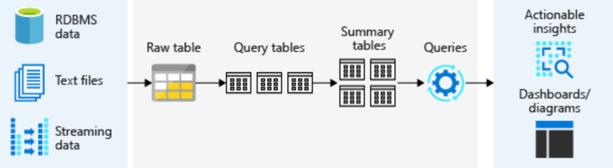

Delta Architecture

## Data Lake Challenges
A data lake is a storage repository that inexpensively stores a vast amount of raw data, both current and historical, in native formats such as XML, JSON, CSV, and Parquet. It may contain operational relational databases with live transactional data.

To extract meaningful information from a data lake, you must solve problems such as:

- Schema enforcement when new tables are introduced.
- Table repairs when any new data is inserted into the data lake.
- Frequent refreshes of metadata.
- Bottlenecks of small file sizes for distributed computations.
- Difficulty sorting data by an index if data is spread across many files and partitioned.

There are several architectural ways to deal with this, such as Lambda or Kappa architecture. This is however a challenge, especially when combining the streaming tier and batch tier into a single comprehensive report.

***
## DataBricks Delta
Delta Lake is an open source storage layer that brings reliability to data lakes. Delta Lake provides ACID transactions, scalable metadata handling, and unifies streaming and batch data processing. Delta Lake sits on top of Apache Spark. The format and the compute layer helps to simplify building big data pipelines and increase the overall efficiency of your pipelines. Delta Lake decouples the data stream into three parts:

- Text files, RDBMS data, and streaming data are collected into a raw table, also known as a bronze table at Databricks. 
- A raw table is then parsed into query tables, also known as silver tables at Databricks. Query tables may be joined with dimension tables.
- Summary tables, also known as gold tables at Databricks, are business-level aggregates. They're often used for reporting, dashboards, and aggregations such as daily active website users.

***
Delta Lake uses **versioned Parquet files** to store your data in your cloud storage. Apart from the versions, Delta Lake also stores a transaction log to keep track of all the commits made to the table or blob store directory to provide ACID transactions.

***
**Raw data** is unaltered data that is collected into a data lake, either via bulk upload or through streaming sources. Since raw data coming in from a stream is transient, we'd like to save it to a more permanent data structure with an explicit schema. 

