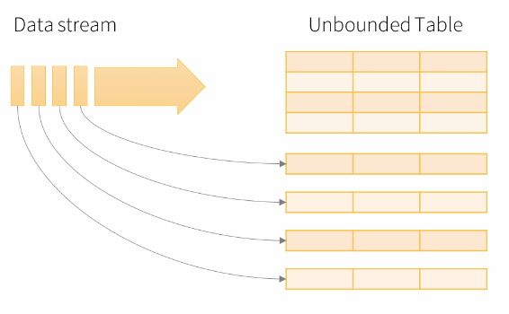
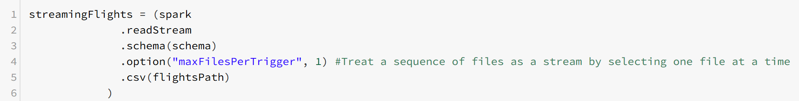
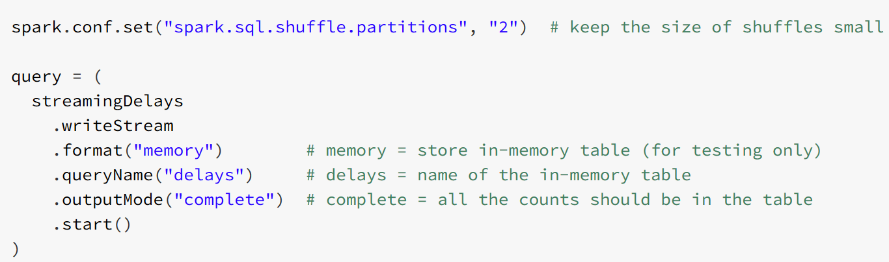

Structured Streaming

In Structured Streaming, a data stream is treated as **an unbounded table that is being continuously appended**. This leads to a stream processing model that is very similar to a batch processing model. For this reason, it's often called **micro-batch processing**. You express your streaming computation as a standard batch-like query as on a static table, but Spark runs it as an incremental query on the unbounded input table.

Consider the input data stream as the input table. Every data item that is arriving on the stream is like a new row being appended to the input table. A query on the input generates a result table. At every trigger interval (say, every 1 second), new rows are appended to the input table, which eventually updates the result table. Whenever the result table is updated, the changed result rows are written to an external sink. The output is defined as what gets written to external storage. Spark can be configured to append the delta or to write the complete table. 

## Demo

To start a streaming query, we only need to specify *spark.readStream* instead of the normal *spark.read* call. In the example below, the option *maxFilesPerTrigger* is used to emulate a stream by looping over a collection of files.

The API is similar to the normal dataframe API. In the example below, we can simply use the common groupby function. The window function is also common and collects observations in buckets of one hour.

The streaming session is started by specifying an output path and invoking the start() function.

We can stop the session via invoking stop().

