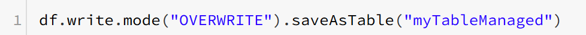
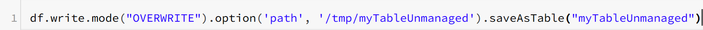

Tables & TempTables

### Data tables in Databricks
**managed table** is a table that manages both the data itself as well as the metadata.  In this case, a `DROP TABLE` command removes both the metadata for the table as well as the data itself.  

**Unmanaged tables** manage the metadata from a table such as the schema and data location, but the data itself sits in a different location, often backed by a blob store like the Azure Blob Storage. Dropping an unmanaged table drops only the metadata associated with the table while the data itself remains in place.

* Write to an unmanaged table by adding an `.option()` that includes a path. Otherwise, it will be stored as managed table. DESCRIBE EXTENDED tableName can be used to obtain information on the table. 

*Example:*
df.saveAsTable(path)

### Temp views in Databricks
A temp view or temp table allows you to use the SQL API on a dataset but it only lives within your current Spark session. 

*Example:*
df.createOrReplaceTempView("tempTableName")

%sql
SELECT *
FROM tempTableName

