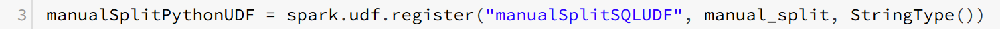
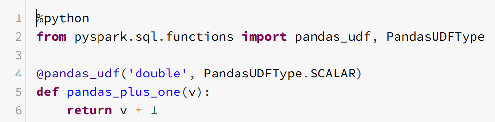

UDF

### UDF
UDFs take a function or lambda and make it available for Spark to use. UDFs can have multiple column inputs and multiple complex outputs. Complex outputs are helpful when you need to return multiple values from your UDF. The UDF design pattern involves **returning a single column to drill down into, to pull out the desired data.**

In brief, use built-in functions whenever possible. There are, however, many specific use cases not covered by built-in functions. UDFs are generally more performant in Scala than Python since for Python, Spark has to spin up a Python interpreter on every exector to run the function. This causes a substantial performance bottleneck due to communication accross the Py4J bridge (how the JVM interoperates with Python) and the slower nature of Python execution.

***
### UDF creation process
1. Create a function or lambda
2. Register the lambda for a language
3. Execute the UDF as a normal function

* In this example, we register the UDF for SQL.  This gives us the same access to the UDF you had in the python DataFrames API. Registering the UDF allows you to use the UDF as it were a normal function, e.g.:

def manual_split(inputString):
    return inputString.split("x")
    
park.udf.register("manualSplitPythonUDF", manual_split, StringType())

split_df = df.select("*",  manualSplitPythonUDF("stringColumn").alias("split_stringColumn"))

**Register the function as a UDF by designating the following:**
* A name for access in Python (`manualSplitPythonUDF`)
* A name for access in SQL (`manualSplitSQLUDF`)
* The function itself (`manual_split`)
* The return type for the function (`StringType`)

***
#### Vectorized UDFs
Starting in Spark 2.3, vectorized UDFs can be written in Python called Pandas UDFs.  **This alleviates some of the serialization and invocation overhead of conventional Python UDFs and is much faster in performance.**

